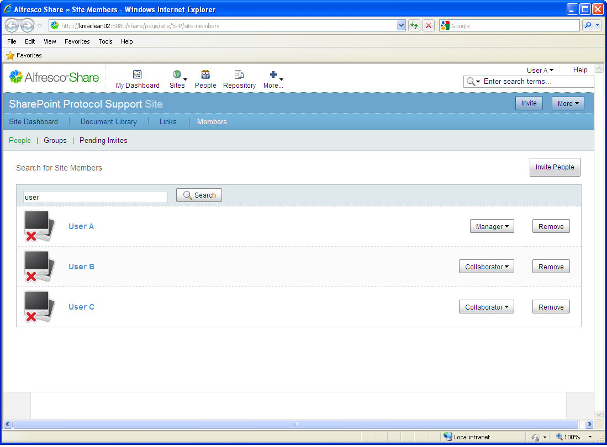

# Change a site member's role

There are four roles available in Share sites: Manager, Collaborator, Contributor, and Consumer. Only a Site Manager can manage site membership by changing a member’s role.

To change a site member’s role:

1.  On the Document Management task pane of the document spp-tutorial.docx, position your cursor over **User C**, open the menu that becomes active, and select **Edit Permission Level**.

2.  When prompted, log in to Share as User A \(userA, userA\).

    Share opens displaying the **Search for Site Members** page.

3.  Type user in the field provided and click **Search**.

    Share returns a list of the site members matching the search criteria entered. The assigned role is displayed for each member. As the Site Manager, you can change the member roles and remove members from the site. For details on performing these tasks, refer to the Share user help.

    

4.  Log out of Share and close the browser.

**Parent topic:**[Manage the Document Workspace membership](../concepts/gs-spp-members-manage.md)

