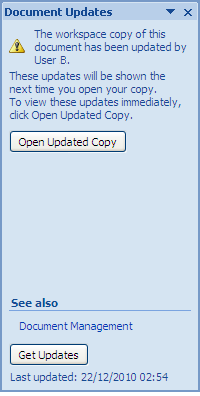

# Manage document updates

When multiple users hold local copies of a Document Workspace document, the Document Updates pane provides you with options for managing the edits. When changes to your local copy are found to conflict with the version stored in the site, this feature enables you to compare the two versions, overwrite either copy, or merge the two copies.

**Important:** You can perform this task only if you were able to complete the previous task \([Saving an updatable copy locally](gs-spp-sitecopy-savelocally.md)\).

1.  Return to your original machine where the document local.docx is open.

2.  On the Document Management task pane, select the Documents tab.

    The document local.docx is highlighted in the **Documents** list.

3.  Position your cursor over the document name, open the menu that becomes active, and select **Document Updates**.

    The Document Updates task pane displays.

    

4.  Click **Open Updated Copy** to obtain the updates.

**Parent topic:**[Work with a Document Workspace document locally](../concepts/gs-spp-work-locally.md)

