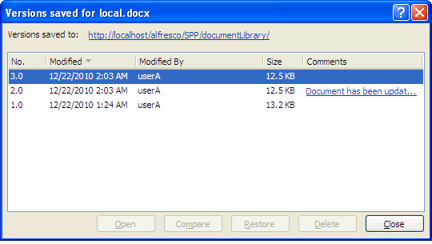

# Manage the document versions

Selecting a previous version of the document in the Versions saved for local.docx dialog box enables both the **Restore** and **Delete** buttons.

Let’s restore the original version of the document as your current version. The dialog box will have closed automatically in the previous task.

To replace the current document with a previous version:

1.  Click the Microsoft Office button and select **Server**, then **View Version History**.

2.  On the Versions saved for local.docx dialog box, select the original document \(version 1.0\) in the version list and click **Restore**.

3.  Click **Yes** to confirm that you want to replace the current version of the document with the selected version.

    **Note:** Office may prompt you to log in again.

    Word replaces the content of the current version with the content of version 1.0.

4.  Click the Microsoft Office button and select **Server**, then **View Version History**.

    Notice that restoring the original content has created a new version: 3.0.

    

    A read-only copy of version 2.0 of the document remains open.

5.  Click **Close** on the Versions saved for local.docx dialog box.

    The document local.docx, now displaying its original content, remains open.

6.  Close the version 2.0 copy of local.docx.

**Parent topic:**[Work with document versions](../tasks/gs-spp-doc-versions.md)

