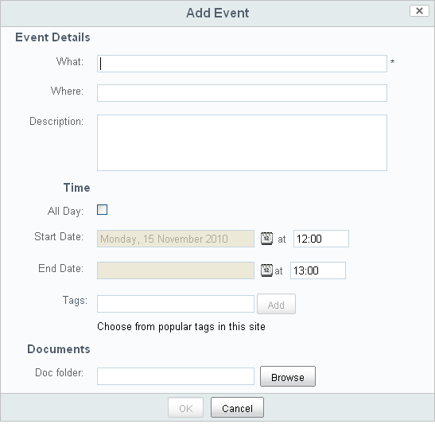

# Schedule a webinar

As part of promoting this collaboration site, you want to schedule a webinar to welcome the new users and discuss the purpose of the site.

**To schedule a webinar:**

1.  Within your site, click **Calendar** on the banner.

    The Calendar page component opens.

2.  Select the date you want to have the webinar and click the **Add Event** icon \(\) within that date.

    The Add Event page displays.

    

3.  Enter the webinar details and click **OK**.

    **Note:** If desired, use the **Browse** button to select a folder to indicate to users where material related to the event is located.

You return to the calendar with your new webinar displayed on the date you scheduled it.

**Parent topic:**[Prepare your site for collaboration](../concepts/gs-site-prepare.md)

