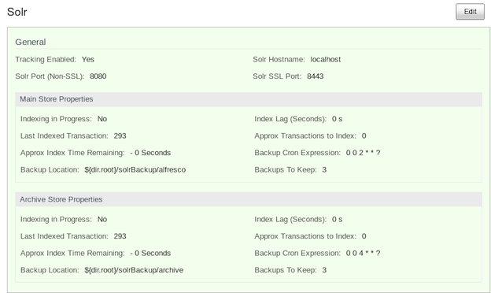

# Backing up Solr

This section describes how to back up the Solr indexes.

You can set the Solr indexes backup properties using the Admin Console in Share or by editing the alfresco-global.properties file. Also, you can backup the Solr indexes using a JMX client, such as JConsole.

**Parent topic:**[Solr backup and restore](../concepts/solr-backup-recovery.md)

## Set up Solr backup properties using Share Admin Console

You can only see the Admin Console if you are an administrator user.

1.  On the toolbar, expand the **More** menu, and then click **More** in the **Admin Tools...** list.

2.  Under the **Tools** section on the left navigation bar, you see various tools available and the options that you can set. In the **Search** sub-section, click on **Solr**.

    The **Solr** window is displayed.

    

    Here, you can specify the backup location and edit backup properties for each core of the Solr index: **Main Store** and **Archive Store**.

    -   **Backup Cron Expression**: Specifies a Quartz cron expression that defines when backups occur. Solr creates a timestamped sub-directory for each index back up you make.
    -   **Backup Location**: Specifies the full-path location for the backup to be stored.
    -   **Backups To Keep**: Specifies the maximum number of index backups that Solr should store.
3.  Click **Edit**.

4.  Specify the full location path on the Solr server file system to store the index backup in the **Backup Location** text box.

5.  Click **Save**.


## Specifying Solr backup directory via alfresco-global.properties file

This task shows how to specify the Solr backup directory via alfresco-global.properties file.

-   To set the solr backup directory using thealfresco-global.properties file, set the value of the following properties to the full path where the backups should be kept:

    ```
    solr.backup.archive.remoteBackupLocation=
    solr.backup.alfresco.remoteBackupLocation= 
    ```


## Back up Solr indexes using JMX client

You can use the JMX client, JConsole to backup Solr indexes, edit Solr backup properties and setup the backup directory.

-   You can set the backup of Solr indexes using the JMX client, such as JConsole on the **JMX MBeans \> Alfresco \> Schedule \> DEFAULT \> MonitoredCronTrigger \> search.alfrescoCoreBackupTrigger \> Operations \> executeNow** tab. The default view is the Solr core summary. Alternatively, navigate to **MBeans \> Alfresco \>SolrIndexes \>coreName \>Operations \>backUpIndex** tab. Type the directory name in the **remoteLocation** text box and click **backUpIndex**.

-   Solr backup properties can be edited using the JMX client on the **JMX MBeans \> Alfresco \> Configuration \> Search \> managed \> solr \> Attributes** tab. The default view is the Solr core summary.

-   To use JMX client to setup Solr backup directory, navigate to **MBeans tab \> Alfresco \> Configuration \> Search \> managed \> solr \> Attributes** and change the values for solr.backup.alfresco.remoteBackupLocation and solr.backup.archive.remoteBackupLocation properties.


