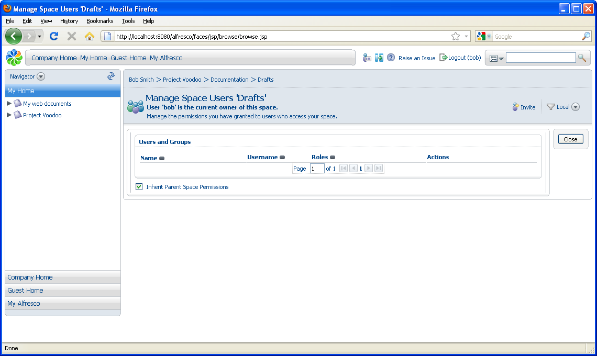
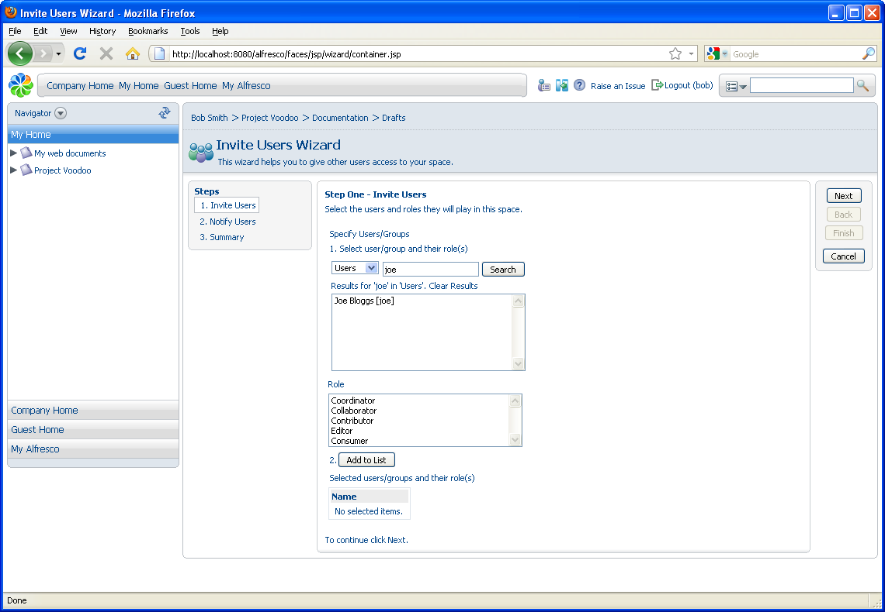

# Collaborating with other users

To work with other users on this project, you will invite them to a space for collaboration.

1.  Ensure you are in the Drafts space. In the **More Actions** menu for this space, click **Manage Space Users**.

    This page displays users who have permission to work on content in the Drafts space.

    

2.  Click **Invite** in the header to invite a user to the space.

    This opens the Invite Users Wizard.

3.  In Step One - Invite Users, you select a user and specify their role. Type joe and click **Search**. The list of results displays.

    

4.  Select **Joe Bloggs**, assign him the **Consumer** role, and click **Add to List**.

5.  Click **Next**.

6.  In Step Two - Notify Users, you are given the option to send the invited users an email telling them about the invitation. As you haven't configured email, select **No** and click **Next**.

7.  Verify the information in the Summary and click **Finish**.

8.  Click **Close** to return to the Drafts space.

**Parent topic:**[Getting Started with Alfresco Explorer Document Management](../concepts/cgs-intro.md)

