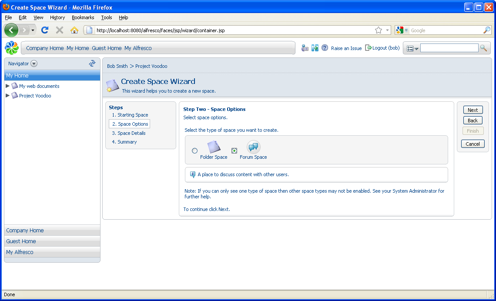
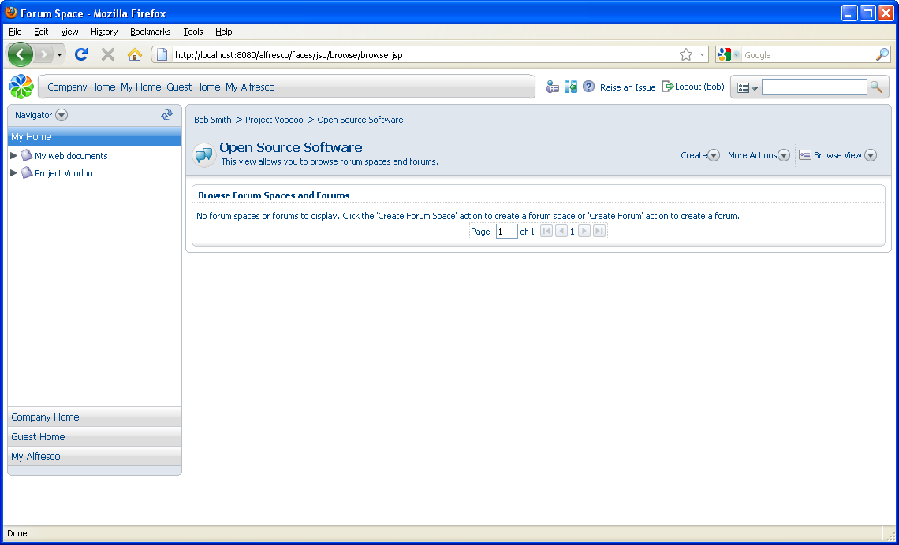
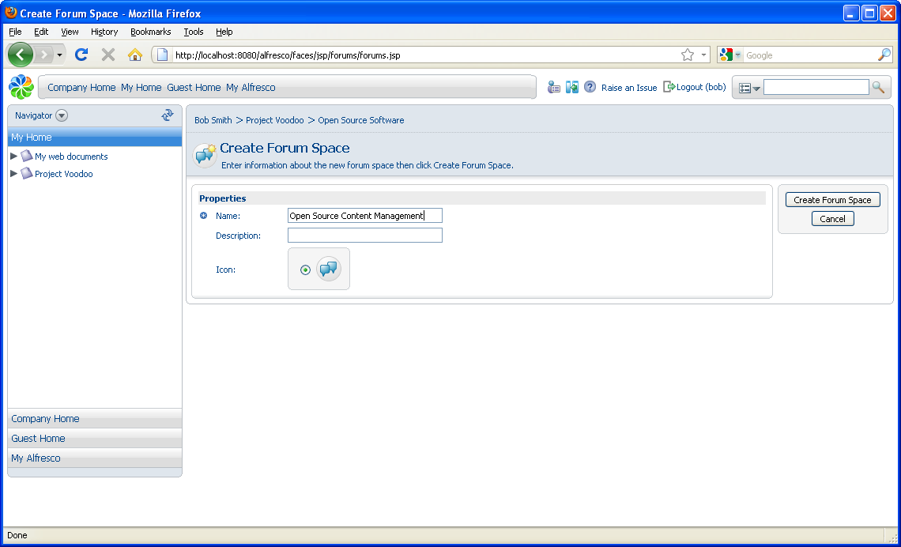
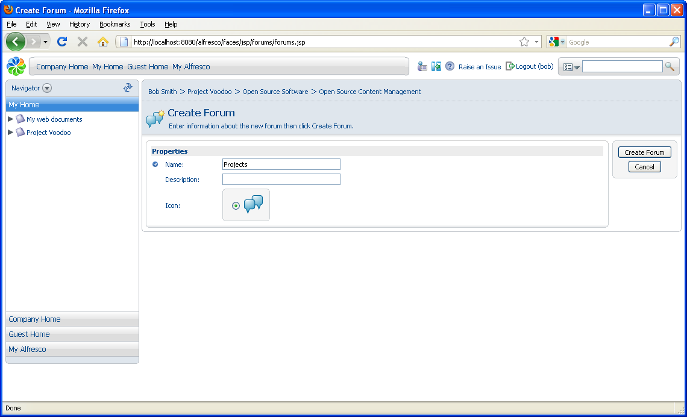

# Creating a forum

A forum space allows people to collaborate using forums and discussions. A forum space can contain any number of forums, or even other forum spaces if wanted.

1.  Navigate to the Project Voodoo space.

2.  In the **Create** menu, click **Advanced Space Wizard**.

3.  In Step One, select to create the space **From scratch** and click **Next**.

4.  In Step Two, select **Forum Space.**

    

5.  Click **Next**.

6.  In Step Three, type Open Source Software as the **Name** and click **Finish**.

7.  Open the Open Source Software space.

    

    You will use a sub forum space to organize your forums.

8.  In the **Create** menu, click **Create Forum Space**.

9.  Type Open Source Content Management as the **Name**.

    

10. Click **Create Forum Space**.

11. Open the Open Source Content Management space.

12. In the **Create** menu, click **Create Forum**and name the forum Projects.

    

13. Click **Create Forum**.

-   **[Creating a topic](../tasks/tgs-create-topic.md)**  
In this task, you will create a topic within a forum.

**Parent topic:**[Forums and discussions](../concepts/cgs-forumsdiscussions.md)

