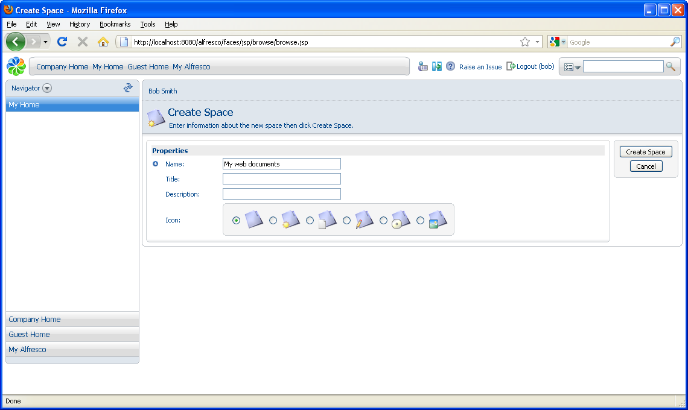
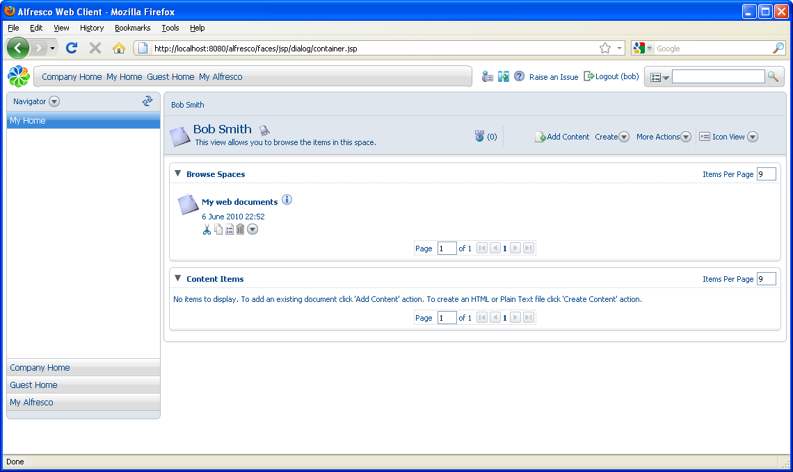

# Creating a space

Before adding content, organize your home space to meet your business needs \(including collaboration\). For this example, you will create a sub space called *My web documents* for HTML files.

1.  In the **Create**menu in the header, click **Create Space**.

    The Create Space page displays.

2.  Type My web documents as the space name. Optionally, you can specify a title and description, and select an icon to represent the type of content you intend to put in the space.

    

3.  Click **Create Space**. Your home space displays with the new space listed.

    

4.  In the Navigator header in the sidebar, click  **\(Refresh\)** to synchronize the navigator bar.

    You can now create web content directly in the browser.

**Parent topic:**[Creating spaces and content](../tasks/tgs-create-spacecontent.md)

