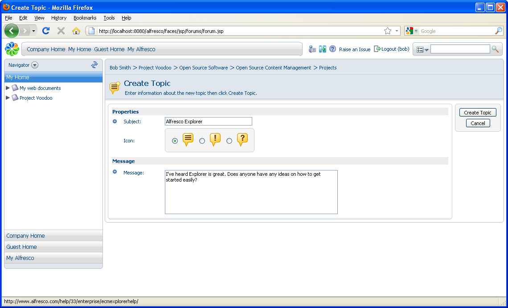
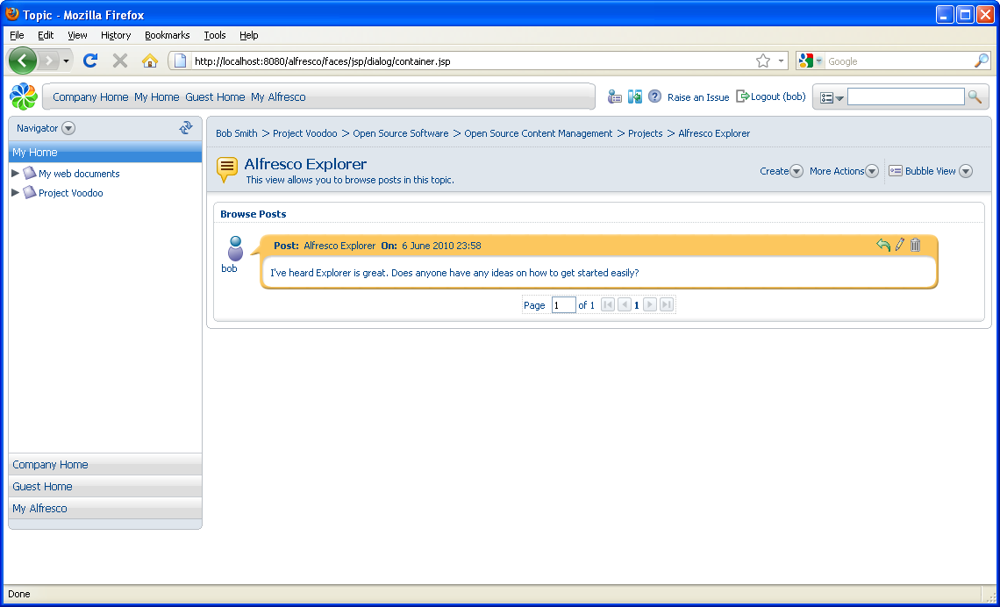
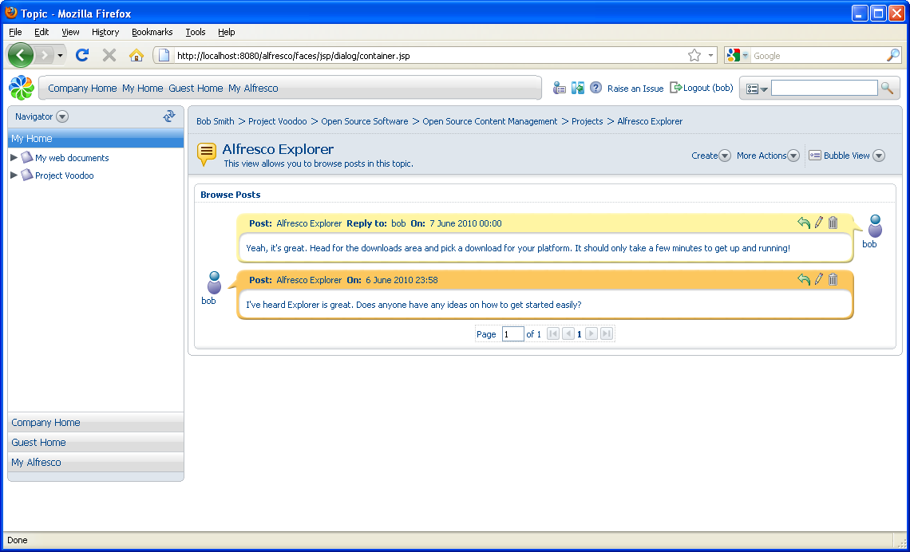

# Creating a topic

In this task, you will create a topic within a forum.

1.  Navigate to and open the Projects forum.

2.  In the **Create** menu, click **Create Topic**.

3.  Enter the topic details in the **Subject** and **Message** boxes. You can select an icon to represent the type of message you are posting.

    

4.  Click **Create Topic**.

    Once a topic is created, it is always possible to edit and change it, or even delete it. The icons on a post determine what actions you are allowed to take.

    

    Any other user with the right permissions will be able to reply to the post \(using the **Post Reply** icon: \). By default, the most recent post is at the top.

    

**Parent topic:**[Creating a forum](../tasks/tgs-create-forum.md)

