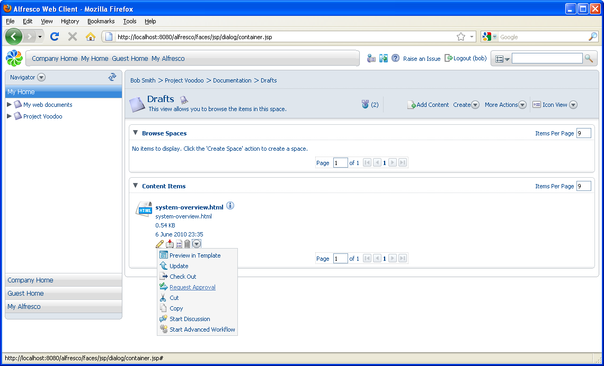
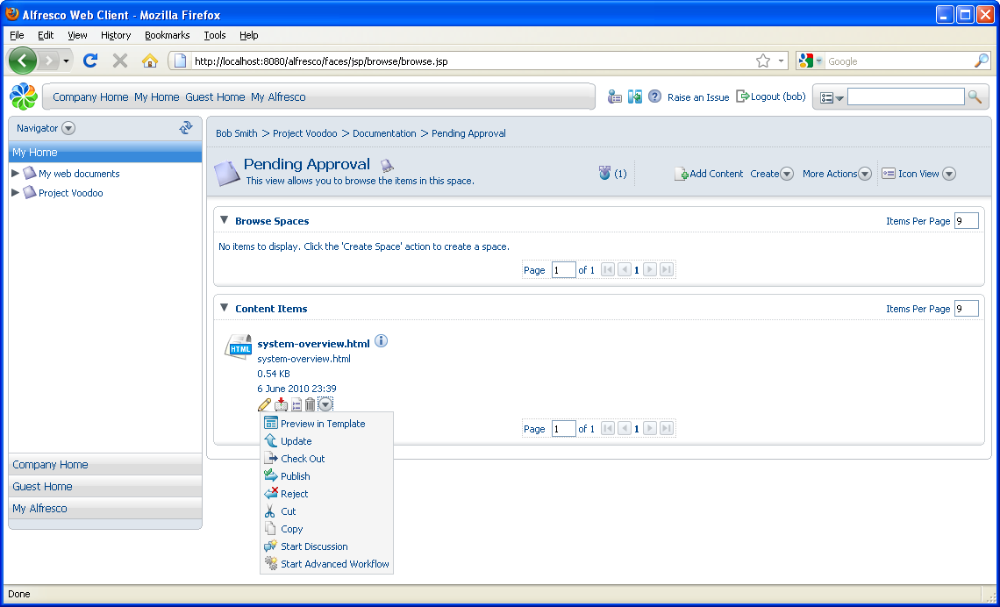

# Sending content for review

When content has been completed, it can be sent for review. Any workflow steps that are available for an item of content are shown in its actions, either from the **More Actions** icon or from the **View Details**icon associated with the content item.

1.  In the Content Items pane, click  for the item **system-overview.html** and select **Request Approval**.

    

    The content item moves to the Pending Approval space.

2.  Navigate to the Pending Approval space where you can see the **system-overview.html** content item.

    **Note:**

    Another rule could have been defined to send an email alert to the reviewers of this document.

3.  Click  for this item to see the **Publish** and **Reject**workflow steps you created as a rule.

    

4.  Click **Publish** to move the content to the Published space.

Alfresco also has integrated Business Process Management \(BPM\) capability. This goes beyond the Simple Workflow folder-based method of sending content for review, allowing content to remain where it is while complex workflows can operate on it. The BPM-based workflow creates tasks for users to complete, with these showing up in the user’s My Tasks To Do Dashboard Component.

**Parent topic:**[Getting Started with Alfresco Explorer Document Management](../concepts/cgs-intro.md)

