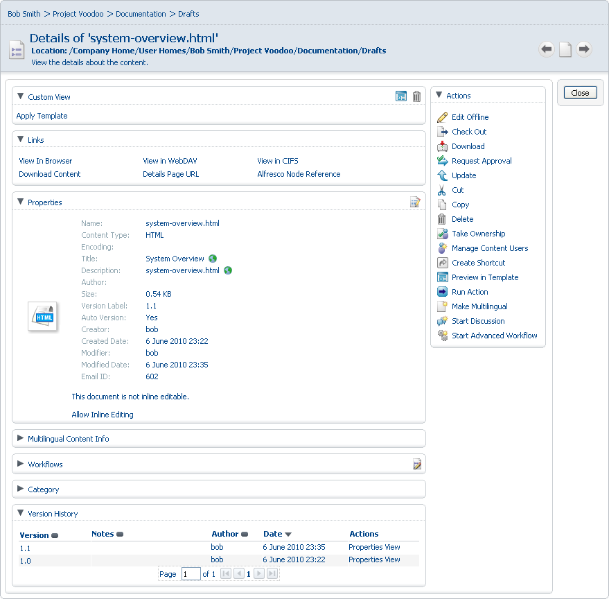

# Version history

You can view the version history for content in a space. As the content is versioned, previous iterations are available in the version history.

1.  Click  \(**View Details**\) for the document **system-overview.html**.

2.  On the Details page, expand the Version History pane. The current version is listed.

    

**Parent topic:**[Editing content in a collaborative space](../concepts/cgs-edit-collaborativecontent.md)

