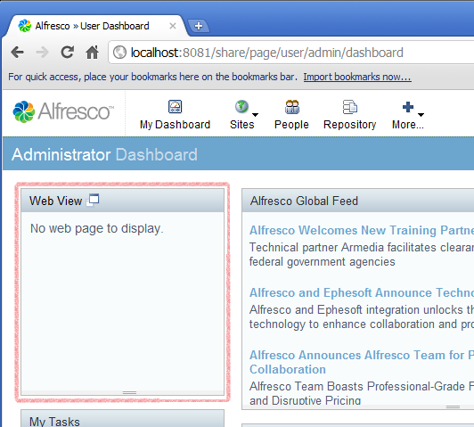
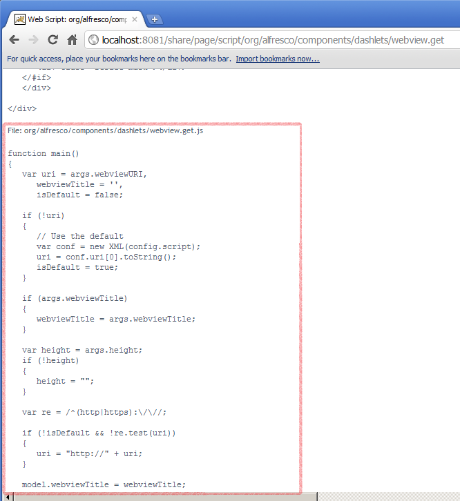
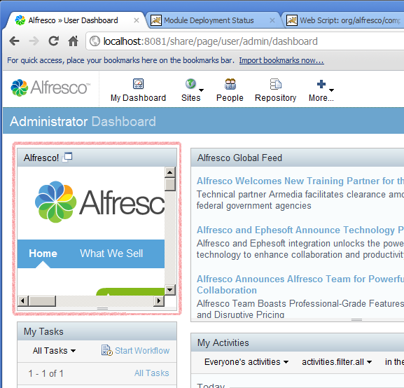

# 5. Customize Alfresco Share JavaScript controllers

Extension module `customizations` elements can be used to override behaviour of components. This tutorial uses customizations to override the behaviour of the WebView dashlet.

This tutorial demonstrates how to provide an extension to the JavaScript controller file for the web script behind the Web View dashlet. This changes the behaviour of Web View so that the Alfresco.com website is displayed by default.

1.  First, add the **Web View** dashlet to the User Dashboard:

    1.  Log in to Alfresco Share.

    2.  Click the **Customize Dashboard** button.

    3.  Click **Add Dashlets**.

    4.  Drag the **Web View** dashlet from the available list and drop it into one of the dashboard columns.

    5.  Click **OK**.

    Initially, the dashlet displays the message **No web page to display** as it has not yet been configured.

    

2.  First enable SurfBug, using the page `http://localhost:8080/share/page/surfBugStatus`. Again, this link is correct if you are using the default port on a local server.

3.  Click on the **Web View** dashlet to find the Web Script URI \(`/components/dashlets/webview`\) that renders it. Then browse for Web Scripts by URI \(http://localhost:8080/share/page/index/uri/\) to access all the necessary information \(including the source of the JavaScript controller\) that you will need.

    

    By inspecting the source of both the controller and the template, you can work out what model properties the template is using. This allows you to determine whether or not you can update the model after the base controller but before the template to create the desired result.

    Having identified that the dashlet is rendered by a web script using the controller  **webview.get.js** in the **org.alfresco.components.dashlets** package, you can define a new module with a customization to apply to it.

4.  Edit the **blog-demo.xml** file and add the following module configuration:

    ```
    
                                
    <module>        
      <id>Blog Module  (Web View JavaScript controller change) </id>        
      <customizations>            
        <customization>                
            <targetPackageRoot>org.alfresco.components.dashlets</targetPackageRoot>                
            <sourcePackageRoot>blog.demo.customization</sourcePackageRoot>             
         </customization>       
        </customizations>   
    </module>
    
    
    ```

    The target package can be mapped into the source package `blog.demo.customization`.

5.  Create a file called **webview.get.js** that contains the following:

    ```
    
    
    if (model.isDefault ==  true )   
    {        
        model.webviewTitle =  "Alfresco!";        
       model.uri =  "http://www.alfresco.com";        
       model.isDefault =  false;   
    }             
    
                            
    ```

6.  Place the new file in the `webscripts.blog.demo.customization` package, rebuild and deploy your JAR, restart the web server, and deploy your new module. When you log in to Alfresco Share, you will see that the Web View dashlet now displays the `www.alfresco.com` website.

    


It may not always be possible to use this approach to customize existing components, as it depends on how the JavaScript controller and template are implemented, but the approach is worth exploring.

**Parent topic:**[Tutorials](../concepts/surf_share_v4-tutorials.md)

