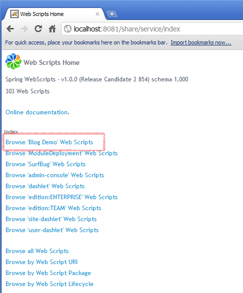
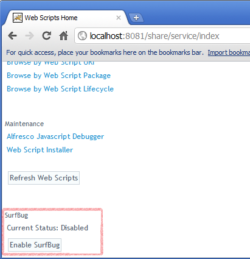
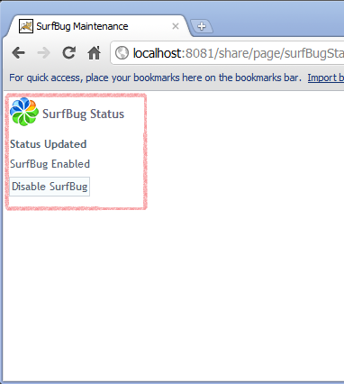
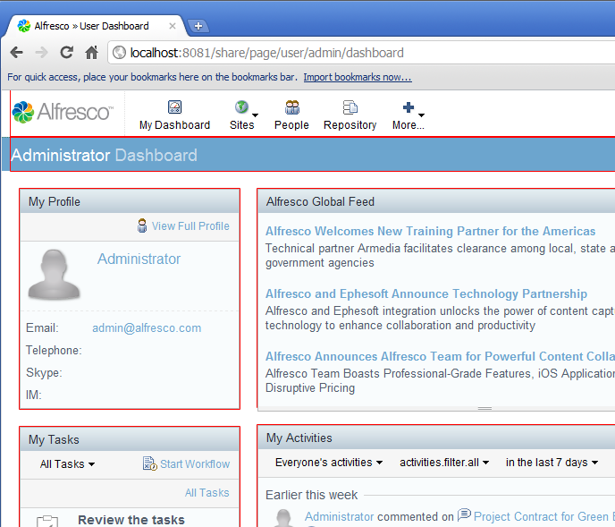
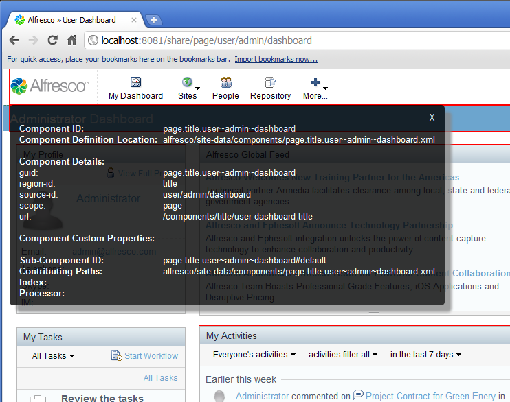
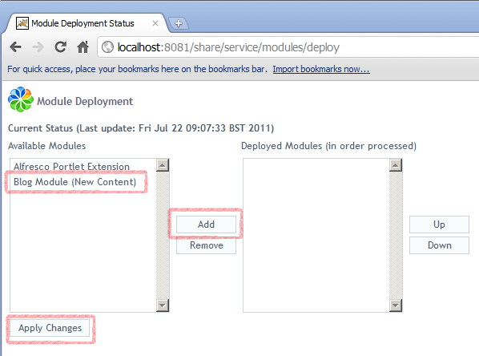
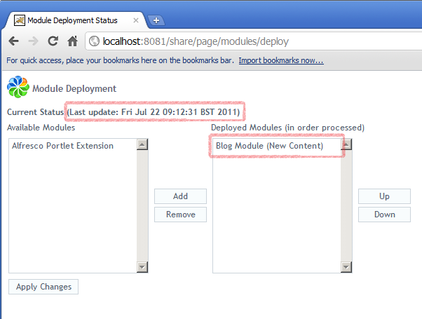
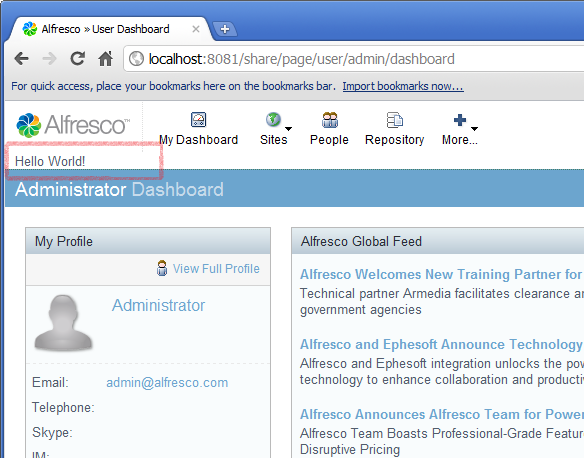

# 1. Add content to an Alfresco Share page

This tutorial demonstrates how to create and deploy an extension module that adds some extra content to a user dashboard page in Alfresco Share.

A simple and effective way to add content to an Alfresco Share page is to create the content as a web script and then add a new Sub-Component an existing Component on the page.

The content is implemented through an Extension Module deployed into Alfresco Share as a JAR file. The JAR file needs to contain the following packages:

-   alfresco.site-data.extensions
-   alfresco.site-webscripts

1.  It is necessary to create two files to implement the content through a webscript: a descriptor file and a template.

    1.  Create a new descriptor file called `new-content.get.desc.xml` that contains the following:

        ```
        
                                                                        
        <webscript>      
         <shortname>New Content</shortname>       
          <url>/blog/demo/new-content</url>       
          <family>Blog Demo</family>   
        </webscript>
        
        
        ```

    2.  Create a new template file called **new-content.get.html.ftl** that contains the following:

        ```
        
        
        <div>         
          Hello World!     
        </div>   
        
        
        ```

2.  Build a JAR file so that the descriptor and template files are in the alfresco.site-webscripts package. Copy the JAR file into the webapps/share/WEB-INF/lib folder in Tomcat \(or the equivalent location in whatever web server you are using\) and start \(or restart\) the server.

    **Note:** Note that a JAR located in this folder will be lost if Alfresco is upgraded or if the WAR is re-deployed. However, the location is suitable for the purposes of this tutorial.

3.  Open a browser at the URL [http://localhost:8080/share/service/index](http://localhost:8080/share/service/index). This assumes the server is running on your local machine and that Tomcat is using the default port setting. The Web Scripts Home page will be displayed. Check for the link **Browse 'Blog Demo' Web Scripts**. This indicates that your new web script has been successfully registered.

    

    You now need to select a location within the page to which you will add your new content. The location can be identified using the SurfBug tool. SurfBug is described in more detail in the [SurfBug tutorial](../concepts/Surf_v4_surfbug.md).

4.  Log in to Alfresco Share \(http://localhost:8080/share\) in a separate browser window or tab. Switch back to the tab containing the Web Scripts Home page, scroll to the bottom and click **Enable SurfBug**. The page refreshes and the button changes to **Disable SurfBug**.

     

5.  Switch back to the Alfresco Share window and refresh the page. The Dashboard page now displays various page components delimited by a red box. Click in any of the boxes and a pop-up displays information about that Sub-Component and its parent Component.

     

6.  Click on the titlebar and make a note of the Component Details, in particular the `region-id`, `source-id` and `scope` values. If you are logged in as Admin these will be as follows: `title`, `user/admin/dashboard`, and `page`. This is the information that you will need when defining a new Sub-Component to that existing Component.

7.  Create a new extension file called blog-demo.xml that contains the following:

    ```
    
    
    <extension>         
      <modules>                
        <module>                      
          <id>Blog Module (New Content)</id>                        
          <components>                             
              <component>                                    
                  <region-id>title</region-id>                                    
                  <source-id>user/admin/dashboard</source-id>                                    
                  <scope>page</scope>                                    
                  <sub-components>                                          
                    <sub-component id= "New_Content" index= "25" >                                                
                    <url>/blog/demo/new-content</url>                                          
                   </sub-component>                                   
                  </sub-components>                              
              </component>                        
           </components>                  
         </module>            
        </modules>   
    </extension>
    
    
    ```

    Note how the target Component is specified using the data taken from SurfBug and how the Sub-Component specifies the URL of the new web script created.

8.  Re-build the JAR file so that the extension file is located in the alfresco.site-data.extensions package. Copy the new JAR over the old one in the webapps/share/WEB-INF/lib folder, and restart the web server.

9.  The extension module needs to be deployed before it will be visible. Module deployment is a new feature in Alfresco 4.0 that is achieved through a web script found at: `http://localhost:8081/share/service/modules/deploy`. Navigate to this page to view a list of Available Modules and a list of Deployed Modules. Initially you will see the following two modules available: Alfresco Portlet Extension, and Blog Module \(New Content\)

10. Select **Blog Module \(New Content\)** and click **Add** to move it into the **Deployed Modules** list. Then click **Apply Changes**. Note that the **Last update** time stamp changes. You only need to do this action once as Module Deployment data is saved into the Alfresco Repository.

    

11. Now log back in to Alfresco Share and you will see the content from the new web script displayed above the titlebar.

      


**Parent topic:**[Tutorials](../concepts/surf_share_v4-tutorials.md)

