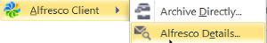

# Using the Alfresco Outlook Client

The Alfresco Outlook Client is part of Alfresco Outlook Integration and allows you to use email and repository management without having to leave Microsoft Outlook. Features include the ability to directly archive emails into Alfresco, full search, tagging and workflow capabilities, and the ability to attach documents and view archived emails in your inbox.

When an email is archived, it is identified with an Alfresco icon in the Outlook inbox: 

An email that is archived as an attachment can be opened directly by double-clicking the email in Outlook. The email looks the same as it did before archiving and can be read normally.

An email that is archived as a link can be loaded into Outlook by clicking the link in the email.

**Note:** Alternatively, right-click the email and select Alfresco Client, and Alfresco Details: 

Click Open to open a new Outlook window where you can view the email.

A check is made for duplicates during email archiving. The email ID of each email is checked to see if the email has already been saved in the same folder or on the same site. If the email has already been saved, a message is displayed saying that the message already exists in the repository, giving details of who archived the file, when it was archived, and the path of the archived file. You can then choose one of the following options:

-   Open the previously archived email
-   Overwrite the previously archived email if the email to be overwritten is in the same folder and overwriting has been enabled in the Alfresco Admin Tools settings \(see [Configuring email integration settings in Alfresco Share](../tasks/Outlook-admin-integration.md) from more information\)
-   Cancel the new archive operation

For information about installing and configuring Alfresco Outlook Integration, see [Installing and configuring Alfresco Outlook Integration](Outlook-install-intro.md).

-   **[Archiving emails directly in Outlook](../tasks/Outlook-using-archive.md)**  
Set automatic archiving using the Alfresco Outlook Client, or archive emails directly.
-   **[Adding metadata to email during archiving in Outlook](../tasks/Outlook-using-archive-metadata.md)**  
When you archive an email in Outlook, the email is saved in Alfresco. If archiving is configured to allow metadata entry, a dialog appears before transfer of the email to Alfresco.
-   **[Managing files using the Alfresco Outlook Client document library](../tasks/Outlook-email-manager.md)**  
In Outlook, use the Alfresco Outlook Client document library to browse and work with your connected Alfresco repository.
-   **[Managing archived files in Alfresco Share](../concepts/Outlook-using-share.md)**  
View your archived emails in Alfresco Share, just like any other documents in Alfresco. Email filters allow you to search for the archived emails in a site or across Alfresco.

**Parent topic:**[Using Alfresco](../concepts/master-using-intro.md)

