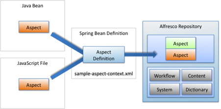

# Content behavior

The Alfresco repository lets you inject behavior into your content, such as enforcing certain policies or executing custom business logic through the use of aspects.

Aspects let you describe additional metadata, such as properties and associations. They also let you override and inject your own handlers for events that occur to the content instance that has the aspect applied. Using aspects, you can inject your own business logic as method handlers for events that are raised, such as when a content property is modified.

You can write your own business logic using JavaScript files or Java beans, which you then need to register with your aspect in the Alfresco repository. The following figure shows the basic registration pattern.



You can declare the aspect available to the system using a Spring bean that might be defined like this:

```
<bean id="extension.sampleaspect" class="org.alfresco.sample.SampleAspect"
  init-method="init">
   <property name="policyComponent">
     <ref bean="policyComponent" />
   </property>
   <property name="serviceRegistry">
     <ref bean="ServiceRegistry"/>
   </property>
</bean>
```

When the aspect code’s `init` method is called, it registers itself with the Alfresco repository using the same namespace as defined in the content model. That way, Alfresco knows how to invoke the aspect’s interceptors.

Here is a sample aspect that intercepts the `onUpdateProperties` event and injects its own method to log the event to the Java console or log file. The aspect identifier is \{http://www.alfresco.org/module/ sample/1.0\}sample, the same identifier used in the content model to define properties and metadata.

```
public class SampleAspect extends AbstractPolicyServiceBean
  implements NodeServicePolicies.OnUpdatePropertiesPolicy
{
  public void init()
{
  this.policyComponent.bindClassBehaviour(
  QName.createQName(NamespaceService.ALFRESCO_URI, "onUpdateProperties"),
  QName.createQName("http://www.alfresco.org/model/sample/1.0", "sample"),
  new JavaBehaviour(this, "onUpdateProperties",
  NotificationFrequency.TRANSACTION_COMMIT));
}
public void onUpdateProperties(NodeRef nodeRef, Map<QName, Serializable> before,
  Map<QName, Serializable> after)
 {
  System.out.println("onUpdateProperties heard for " + nodeRef.toString());
  System.out.println("before: " + before + ", after: " + after);
 }
}
```

Several aspects are provided out of the box for managing things such as content lifecycle, locking, and auditing.

**Parent topic:**[Alfresco repository extension points](../concepts/customize-overview.md)

