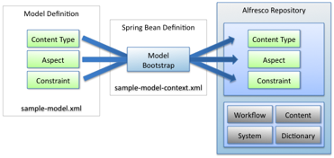

# Content models

A content model defines content types, aspects, and constraints in an XML file that declares a namespace and all its members. These members belong to the namespace and an associated prefix. For example, the prefix `cm` refers to the formal namespace www.alfresco.org/model/content/1.0.

A content type has metadata on it, which comprises properties and associations. Properties have names and values \(either single or multi-value\). Associations define relationships to other content nodes in the repository. Child associations define associations to objects that are considered part of the parent object. When the parent object is deleted, so are the child-associated objects.

Aspects are similar to content types in that they are containers of properties and associations. Aspects are implemented using the Aspect-Oriented Programming \(AOP\) framework within Spring. Aspects let you define metadata and behavior that cuts across one or more nodes in the repository. You can apply aspects at any time as you see fit. Aspects can be applied arbitrarily to content types as well as content instances.

Both content types and aspects feature inheritance. When a content type or aspect inherits from a parent, it incorporates all the parent’s properties, associations, and aspects. If a content type has an aspect applied, the inheriting content type will also have the aspect applied. A content model can also define one or more constraints. Constraints allow you to ensure the validity of your content ahead of persisting it \(for example, when the object is saved\). For instance, you may specify a regular expression that must be evaluated against a property to ensure that a property’s value is in a valid format. Content models are defined in an XML file. You bootstrap the XML file into the Alfresco repository using a Spring bean, which is defined in its own XML file \(see the following figure\).



You can define content types, aspects, and constraints as part of a content model using these two XML files that are placed into <*installLocation*\>\\tomcat\\shared\\classes\\alfresco\\extension.

When Alfresco starts up, it finds the sample-model-context.xml file that declares the Spring bean responsible for bootstrapping the model into the repository model registry. This may appear as follows:

```
<bean id="extension.dictionaryBootstrap" parent="dictionaryModelBootstrap" 
  depends-on="dictionaryBootstrap"> 
   <property name="models"> 
   <list> 
     <value>alfresco/extension/sample-model.xml</value> 
   </list> 
   </property> 
</bean>
```

Everything described inside the sample-model.xml file is available to the repository and accessible to end users from any of the Alfresco service interfaces.

**Parent topic:**[Alfresco repository extension points](../concepts/customize-overview.md)

