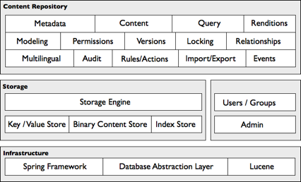
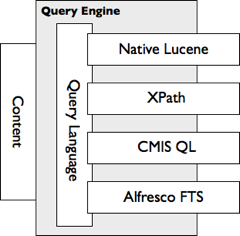

# Alfresco content repository

The content repository is comparable to a database, except that it holds more than data. The binary streams of content are stored in the repository and the associated full-text indexes are maintained by the Lucene indexes.

The actual binary streams of the content are stored in files managed in the repository, although these files are for internal use only and do not reflect what you might see through the shared drive interfaces. The repository also holds the associations among content items, classifications, and the folder/file structure. The folder/file structure is maintained in the database and is not reflected in the internal file storage structure.

The Alfresco content repository implements services defined by the CMIS and JCR standards, which include:

-   Definition of content structure \(modeling\)
-   Creation, modification, and deletion of content, associated metadata, and relationships
-   Query of content
-   Access control on content \(permissions\)
-   Versioning of content
-   Content renditions
-   Locking
-   Events
-   Audits
-   Import/Export
-   Multilingual
-   Rules/Actions

The Alfresco content repository implements and exposes these services through an Alfresco API, CMIS protocol bindings, and the JSR-170 Java API. The storage engine of the repository stores and retrieves content, metadata, and relationships, and operates on the following constructs:

-   **Nodes** - provide metadata and structure to content. A node can support properties, such as author, and relate to other nodes such as folder hierarchy and annotations. Parent to child relationships are treated specially.
-   **Content** - the content to record, such as a Microsoft Word document or an XML fragment.

Content models are registered with the content repository to constrain the structure of nodes and the relationships between them, and to constrain property values.

The storage engine also exposes query capabilities provided by a custom query engine built on Apache Lucene that supports the following search constructs:

-   Metadata filtering
-   Path matching
-   Full text search
-   Any combination of the above

The query engine and storage engines are hooked into the transaction and permission support of the infrastructure, offering consistent views and permission access. Several query languages are exposed, including native Lucene, XPath, Alfresco FTS \(Full Text Search\), and CMIS Query Language \(with embedded Alfresco FTS\).

By default, Alfresco stores nodes in an RDBMS while content is stored in the file system. Using a database provides transaction support, scaling, and administration capabilities. Alfresco uses a database abstraction layer for interacting with the database, which isolates the storage engine from variations in SQL dialect. This eases the database porting effort, allowing the certification of Alfresco against all the prominent RDBMS implementations. The file system stores content to allow for very large content, random access, streaming, and options for different storage devices. Updates to content are always translated to append operations in the file system, allowing for transaction consistency between database and file system.

You can bundle and deploy the Alfresco content repository independently or as part of a greater bundle, such as the Alfresco content application server.

**Parent topic:**[Architecture](../concepts/alfresco-arch-about.md)

