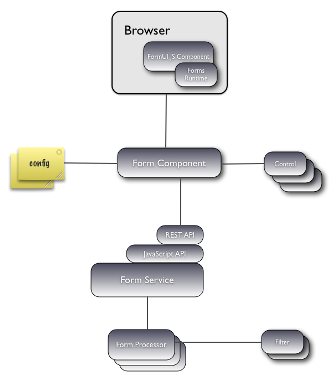

# Forms architecture

The forms engine consists of four major parts:

-   Form service
-   Form component
-   Form configuration
-   JavaScript formUI component, which includes the forms runtime

The following diagram shows a high-level architecture diagram of the forms engine.

The forms runtime is responsible for the execution of a form. It manages all input, validation \(client or call-back\), events, submission, and it consists of a small, lightweight JavaScript library. An unobtrusive JavaScript pattern is used, where behavior is added to the HTML form elements when the page loads. The forms runtime provides the following capabilities:

-   Mandatory property handling
-   Validation \(enforceable at submission, as the user types or when a field loses focus\), which includes:
    -   Regular expression matching
    -   String length
    -   Email address
    -   Is number
    -   Numeric range
    -   Date range
    -   List of values
-   Repeating fields \(for handling multi-valued properties\)

**Parent topic:**[Forms](../concepts/forms-intro.md)

