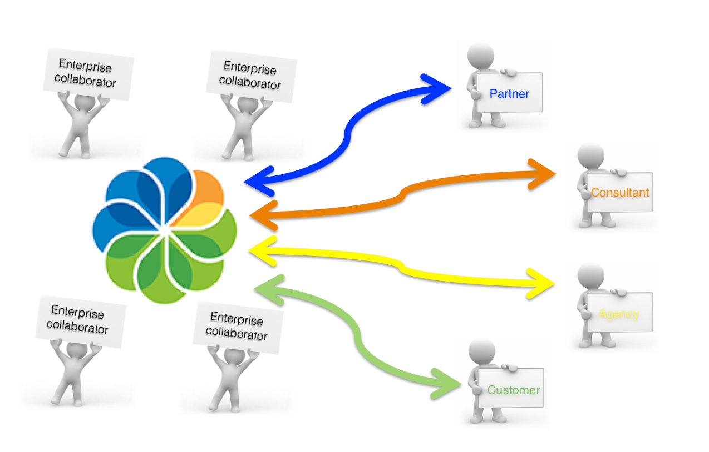

# Getting Started with Alfresco

For most of us, today's work environment means we spend much of our time working in teams that can extend beyond our workplace, and even our enterprise, to include partners, consultants, external agencies, and customers. To collaborate effectively, you need tools to facilitate communication, share information, and run projects. Alfresco provides these tools.

This tutorial introduces you to the basic concepts of Alfresco, taking you through a scenario to demonstrate the flexibility Alfresco provides for working in a collaborative team environment.

In the tutorial you'll learn how to:

-   Personalize Alfresco with your own dashboard and user profile
-   Build a collaboration site for your team
-   Work with content and add it to your site
-   Be social! - invite users to your site, set up meetings and use social media-style features
-   Share content outside of your organization on the cloud

You'll also be shown other little tricks and tips to help you get more out of Alfresco.

We recommend that you go through this tutorial to familiarize yourself with the Alfresco features that will help you to work and collaborate efficiently and effectively.

-   **[Logging in](../tasks/gs-login.md)**  
To start the tutorial you need to login to Alfresco.
-   **[Personalizing Alfresco](../concepts/gs-personal-alfresco.md)**  
 Having installed and signed into Alfresco, the first great thing you can do is to personalize Alfresco to your own tastes and needs.
-   **[Building a site](../concepts/gs-building-site.md)**  
 Now that you've personalized your own dashboard and profile, you're ready to set up a site.
-   **[Working with content](../concepts/gs-site-prepare.md)**  
Before you begin working with content in Alfresco, you'll look at the two different concepts of content there are in Alfresco.
-   **[Being social](../concepts/gs-being-social.md)**  
 You've built a site and you've added some great content to it. The next thing you need to do it to get other users on your site, sharing and creating their own content.
-   **[Sharing content externally](../concepts/gs-sync-share.md)**  
 Having set up your site and added content to it, you can now use the Enterprise to Cloud Sync feature to collaborate with your external partners.
-   **[Alfresco One Getting Started summary](../concepts/gs-summary.md)**  
That brings us to the end of the Alfresco Getting Started guide, and you should now be able to use Alfresco in ways that will improve how you work on a day to day basis.

**Parent topic:**[Getting Started with Alfresco](../concepts/master-gs-intro.md)

