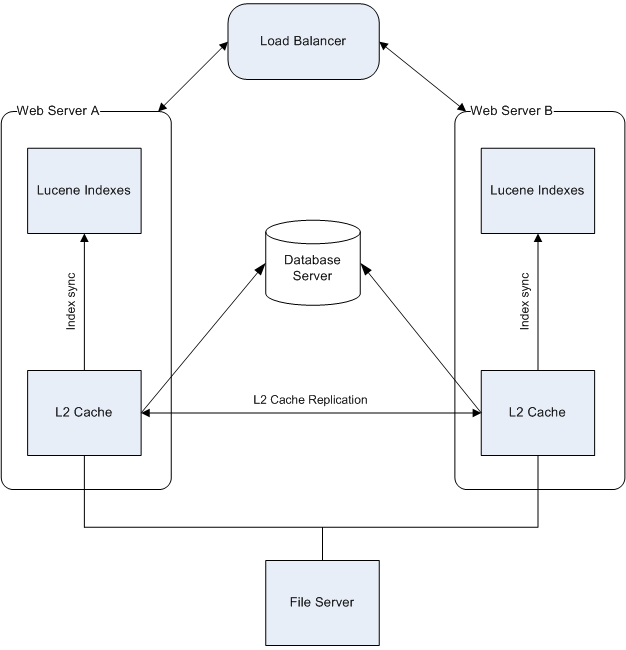

# High availability scenario

This scenario shows a single repository database and file system \(for the content store\) and multiple web application servers accessing the content simultaneously. The configuration does not guard against repository file system or database failure, but allows multiple web servers to share the web load, and provides redundancy in case of a web server failure. Each web server has local indexes \(on the local file system\).

A hardware load balancer balances the web requests among multiple web servers. The load balancer must support 'sticky' sessions so that each client always connects to the same server during the session. The file system and database will reside on separate servers, which allows us to use alternative means for file system and database replication. The configuration in this case will consist of L2 Cache replication, and index synchronization.

**Parent topic:**[Setting up high availability systems](../concepts/ha-intro.md)

