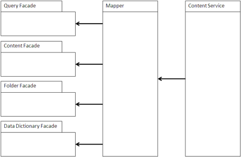

# Content Service Mappers

Not all applications work exclusively with Alfresco APIs. Sometimes there are standardized Service Provider Interfaces to which a content management system provides an implementation. These are often protocol-based services to provide language neutrality and to naturally balance the load between the application and the CMS. Services typically include authentication, query, folder navigation, CRUD \(Create, Read, Update, Delete\) operations, content transfer, and versioning. These services are abstract and mapped onto the Alfresco native APIs.

Most patterns are similar between Content Service Mappers and are generally determined by commonality between the ECM systems they are accessing. As a result, these Content Service Mappers often implement a lowest common denominator of functionality.

## Using a Content Service Mapper

A content service accesses the content management system through either a remote protocol or direct calls. In most cases, the access is remote to allow for reuse of the repository by other applications and to simplify the administration of applications without dependencies on the ECM system. The most common protocols are based on SOAP or RESTful web services, such as AtomPub.

A Content Service Mapper translates the calls into the appropriate mapping in the ECM system. The most common areas of mapping are Data Dictionary for determining what content types are available in the system, content access to map metadata and content streams, folder navigation to map Folder/Space hierarchies, and query interfaces to provide query and retrieval functionality. Query mapping can be complex, such as XML query mapping against an SQL-based system. These mappings are implemented as facades on the underlying ECM system.

Many systems provide kits for implementing a Content Service Mapper. Much of the framework may be already implemented in Java or C, leaving only the mapping functionality of the facades to be implemented.

## When to use a Content Service Mapper

Use a Content Service Mapper when your application connects to more than one CMS and you want to isolate the porting of the application in a separate layer.

Some examples of Content Service Mapper interfaces that are specified by other applications include SAP ArchiveLink for archiving reports and accessing attached image files, IBM/Lotus’s Quickr Services for ECM, and OASIS CMIS as a general-purpose connector for many different types of applications. The Alfresco IMAP protocol mapping is an unusual Content Service Mapper in that it maps content services to an email domain model.

You can also define and build a Content Service Mapper if you need functionality or protocol not covered by CMIS. For example, some applications use JSON for remote access of objects and these applications may need the CMS to comply with this pattern. If an application just needs to access well-structured content as simple objects, then an existing Content Service Mapper may be a simpler, higher-performance solution.

**Parent topic:**[Content management integration patterns](../concepts/integration-patterns.md)

