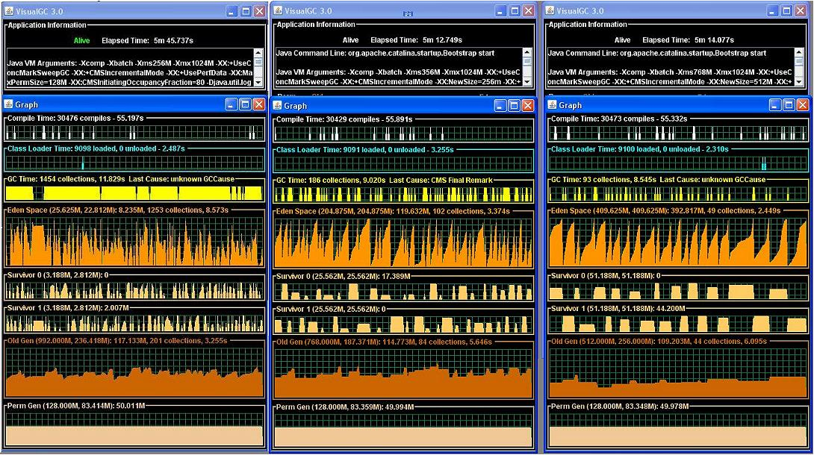

# Effects of NewSize

This section describes the settings for OldGen.

Given that the OldGen is composed primarily of cache data of up to about 520M, at least 1GB should be reserved for OldGen. Once -Xmx increases, the OldGen can be increased to 2G. 512M should be left as a buffer to account for miscellaneous \(PermGen, and so on\). So the following variations might be applied:

```
-Xmx2G -Xms1G -XX:NewSIze=512M (OldGen at least 1G) 
-Xmx3G -Xms1G -XX:NewSize=512M (OldGen at least 2G) 
-Xmx4G -Xms2G -XX:NewSize=1G (OldGen at least 2.5G) 
-Xmx6G -Xms3G -XX:NewSize=2G (OldGen at least 3.5G) 
-Xmx8G -Xms4G -XX:NewSize=3G (OldGen at least 4.5G)
```

If you need these levels, you will need to run JConsole \(and Java 6\) to observe the rate of spillover from Eden space to Survivor to OldGen. If, after the system has been running for a while, the OldGen size stabilizes, then the NewSize can be increased appropriately. The following diagram \(using VisualGC\) shows how varying the NewSize value affects overall garbage collection activity:



**Parent topic:**[JVM settings](../concepts/jvm-settings.md)

