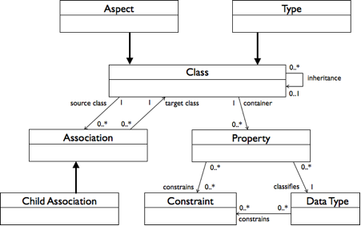

# Content metamodel

Defining a content model is expressed in terms of the content metamodel.

The content metamodel comprises the following:

-   **Type**: A type is at the heart of the content metamodel, and represents objects in the real world with support for properties and the ability to inherit the definition of a parent type.
-   **Properties**: Properties are named items of metadata associated with the type, where each property is of a given data type. Applying constraints let you restrict the values of a property.
-   **Associations**: Associations model relationships between types. Child associations provide the ability to model compositions where the parent effectively owns the children and, therefore, operations like delete will propagate through to the children. Peer associations define a relationship between two objects where neither object is superior to the other.
-   **Aspects**; An aspect supports the same capabilities as a type, meaning it supports properties and may be related to and inherit the definition of a parent aspect. Aspects can be shared across types, allowing cross-cutting of the content model, which is the sharing of property and association definitions by attaching them to multiple types. This is the content metamodel equivalent of multiple inheritance.

Content models constrain the structure of nodes held in the content repository. When a node is created, it is given a type. The type may change over time, as long as the new type is compatible with the old type; however, a node is only ever of one type at any given time. In contrast, a node may be attached to one or more aspects. On creation, a node inherits the aspects attached to its type as defined by the content model at design time. At runtime, you can adjust the aspects attached to a node. This allows content held in the content repository to be loosely constrained and for content to dynamically inherit features and capabilities.

-   **[Metadata XML schema](../concepts/metadata-model-schema.md)**  
A content metamodel is formally described by an XML-schema document. When in doubt about how to express a content model or understand the full capabilities of the content metamodel, interrogate the XML schema as it provides the definitive description of the content metamodel.
-   **[Model Header](../concepts/metadata-model-header.md)**  
Each content model starts with a model header, which provides an introduction to the model containing description, author, publication date, and version number. All parts of the model introduction are optional.
-   **[Model namespaces](../concepts/metadata-model-namespace.md)**  
Namespaces provide a way to specify globally unique names for definitions within content models.
-   **[Model types](../concepts/metadata-model-type.md)**  
A content model may define one or more types.
-   **[Properties](../concepts/metadata-model-props.md)**  

-   **[Associations](../concepts/metadata-model-assoc.md)**  
Associations must be uniquely named and optionally labeled with a title and description.
-   **[Constraints](../concepts/metadata-model-contraints.md)**  
Define constraints in one of two ways: “standalone” allows for the reuse of constraints across many properties; “inline” defines the constraint specifically for a single property.
-   **[Inheritance](../concepts/metadata-model-inheritance.md)**  
A type may inherit its definition from another type. All features of the parent type are inherited, including property, association, and constraint definitions, except for the parent type name, title, and description.
-   **[Aspects](../concepts/metadata-model-aspects.md)**  
Aspects allow property and association definitions to be shared across many types of nodes. This means a cross-cutting feature of an ECM domain model may be encapsulated and applied throughout the rigid part of the model represented by types. It is the equivalent of multiple inheritance.

**Parent topic:**[Content modeling](../concepts/content-modeling-about.md)

