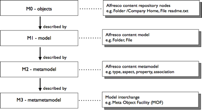

# Content metadata model

Content modeling is about metadata; data describing data. Content modeling in Alfresco refers to a four-layer metadata model.

-   **M0 - Objects** represents nodes, properties, and relationships in the Alfresco content repository that are managed through the various content repository services, such as the File Folder service or CMIS \(Content Management Interoperability Services\).
-   **M1-Model** is a content model that defines a set of related definitions to constrain the nodes in layer M0. Many content models may be registered with the content repository.
-   **M2 - Metamodel** describes a content model, the content metamodel, for expressing new content models. Some standardized content metamodels include the CMIS Data Model and JSR-170 Node Type model.
-   **M3 - Metametamodel** supports the conversion of content models expressed in one content metamodel to another, such as from the CMIS Data Model to JCR Node Types. Out of the box, Alfresco does not provide a definition of the content metametamodel or a conversion tool, but there are third-party tools that specialize in this area.

**Parent topic:**[Content modeling](../concepts/content-modeling-about.md)

