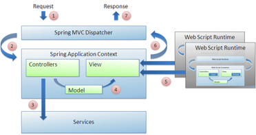

# Web scripts and Surf

Surf lets you reuse web scripts and bind them together into unlimited numbers of pages. The scripts are lightweight, making them easy to assemble and deploy.

Declarative web scripts implement a Model-View-Controller pattern. They have a single descriptor XML file that tells the web script dispatcher how to behave. Declarative web scripts have their own template views and optional scriptable controllers. You write new views by writing new template files. You write new controllers by writing new script files. Your scriptable controllers populate the model variable \(a map\). Your view uses the model during render. Surf allows you to merge your web scripts into the rendering of the overall page. that is, Surf lets your web script MVC participate in the overall Spring MVC.

Surf provides each web script with the appropriate context and runtime environment to render in the context of the overall request. The output of each web script merges with the output of the template to form the final markup. This markup is returned from the Spring MVC View.

For example:

Rather than produce 100% of the output itself, the rendering template occasionally delegates work to the web script runtime when the region tags execute. The web script runtime executes miniature, scriptable MVC processes whose output merges into the overall rendition. The web script runtime can use and take advantage of the full request, user, and page context. You can build web scripts to define component implementations that can be accessed either standalone or stitched into an overall page presentation. A component can be like a widget or a gadget – something that you can plug into a website on one or more pages as a reusable bit of application functionality that participates in the overall page experience.

Web scripts can also be invoked standalone in that they can run outside the context of a page. You can surface components in pop-ups or refresh portions of a web page via AJAX callbacks. Surf also provides portlet capabilities that wrap web scripts and components as JSR-268 portlets and dropped into portal servers.

A Spring project generally maintains web script files as part of its project resources. They could reside under the WEB-INF directory or inside the classpath. Alfresco users can also manage these files inside a content application server.

**Parent topic:**[Presentation content](../concepts/surf-pres-content.md)

