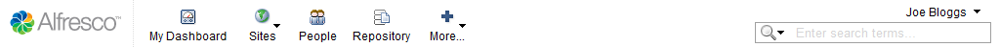

# Finding your way around

When you enter the application your personal dashboard is displayed. This is an interactive user interface that lets you know what is going on in the sites that you belong to. You can customize the information that appears on this page.

The toolbar appears along the top of the page and is always visible.

It contains links to the following pages:

-   **My Dashboard**

    This link displays your personal, configurable dashboard. Wherever you are in the application, click this link to return to your dashboard.

-   **Sites**

    This menu contains your site-related functions. The My Favorites list contains links to any site you mark as a favorite; click a site in this list to navigate to it. There are also links to create a site and to open the Site Finder page, where you can search for sites and manage your site membership.

-   **People**

    This link displays the People Finder page where you search for other Alfresco users.

-   **Repository**

    This link displays the contents of the Alfresco Explorer repository within the framework of a library.

-   **More...**

    This menu lets you easily access information that is specific to you: your tasks, workflows, user profile details, sites, and content. For system administrators this menu also contains links to the Admin Console pages.

The toolbar also contains the following features:

-   ***User* menu**

    The name of the currently logged in user appears as a menu on the right side of the toolbar. In this menu you can update your status to let others know what you are doing. From here you can also access your user profile, change your password, open the user help, and log out.

-   **Search**

    This feature enables you to perform basic or advanced searches for content in the current site or across all sites.

-   **[My Dashboard](../concepts/dashboard-intro.md)**  
Your personal dashboard displays dashlets.
-   **[Sites](../concepts/sites-intro.md)**  
A site is a project area where you can share content and collaborate with other site members.
-   **[People](../concepts/people-intro.md)**  
The People Finder feature lets you search for a particular user or display a list of all users.
-   **[Repository](../concepts/repository-intro.md)**  
The **Repository** feature displays the contents of the Alfresco Explorer repository within the framework of a site library.
-   **[More menu](../concepts/more-menu-intro.md)**  
The **More** menu on the toolbar contains links to pages you may wish to access often to view and manage your tasks, workflows, and user profile. For system administrators this menu also contains links to the Admin Console pages.
-   **[User menu](../concepts/user-menu-intro.md)**  
The name of the currently logged in user appears as a menu above the search field. This menu conveniently contains functionality you may wish to access often.
-   **[Searching for content](../concepts/search-intro.md)**  
The search field provided on the toolbar enables you to quickly perform both basic and advanced searches.

**Parent topic:**[Getting started](../concepts/sh-uh-introduction.md)

**Related information**  

[Performing a basic search](../tasks/search.md)

[Performing an advanced search](../tasks/search-advanced.md)

