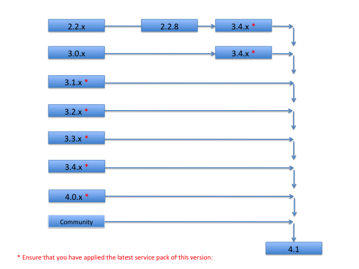

# Alfresco upgrade paths

When you upgrade Alfresco, it is recommended that you follow a structured upgrade path between versions.

Alfresco supports upgrading up to two major versions above your existing version. Alfresco 4.0.x, 3.x, and 2.2.x are considered to be major versions.

The following diagram shows the available upgrade paths:

The following list describes the upgrade paths:

-   Direct upgrades to 4.1.10 are supported from only 3.1.x and later, with the latest Service Pack applied.
-   Upgrades from Alfresco 3.0.x require the latest service pack of version 3.4.x before upgrading to version 4.1.10.
-   Upgrades from Alfresco 2.2.x require the Service Pack 2.2.8 to be applied first, and then the latest service pack of version 3.4.x before being able to upgrade to version 4.1.10.

**Note:** If you are upgrading from an earlier release that is not shown in this section, contact Alfresco Support for assistance.

**Parent topic:**[Upgrading](../concepts/ch-upgrade.md)

