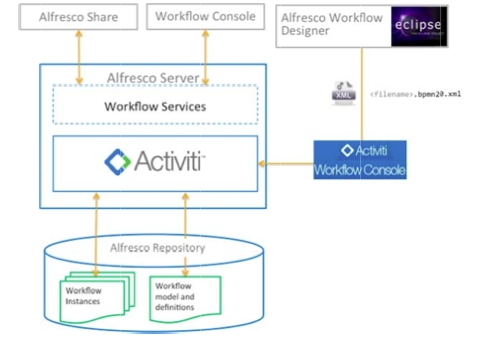
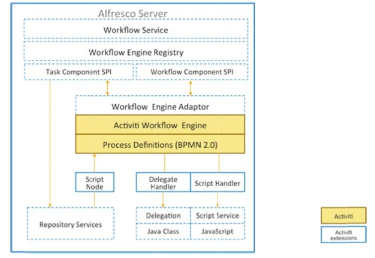

# Workflow Architecture

Alfresco workflow allows more than one workflow engine.

The following figure shows the high‐level architecture for Alfresco workflow. 

You can design workflow definitions using a graphical workflow designer that supports BPMN 2.0 or write the XML BPMN 2.0 process definition directly using an XML editor. Many workflow editors support BPMN 2.0 but may not understand some of the features of Alfresco workflow. We recommend the use of the Activiti eclipse designer plug‐in for Eclipse that is Alfresco-aware.

You can deploy a workflow to Alfresco using the Activiti Workflow Console, or by using a Spring Bean.

Alfresco Activiti process definitions can include Alfresco JavaScript, and this in turn can access Alfresco content models in the repository so that you can provide your own specialized tasks for a workflow and access their properties. Process definitions have script node access which allows you to access objects in the Alfresco repository, such as documents and folders. Your workflow can access and modify document objects, for example marking documents as approved, or signed off.

Alfresco allows you to access your own Java Classes through the delegate handler, so you can integrate with other external systems. The following diagram show these features :- 

-   **[Workflow instances](../concepts/wf-instances.md)**  
 A workflow instance is a running instance of a workflow definition.
-   **[Workflow artifacts](../concepts/wf-artifacts.md)**  
 In Alfresco, a workflow consists a number of artifacts.

**Parent topic:**[Creating and managing workflows](../topics/wf-howto.md)

**Related information**  

[Activiti eclipse designer](http://www.activiti.org/userguide/index.html#activitiDesigner)

