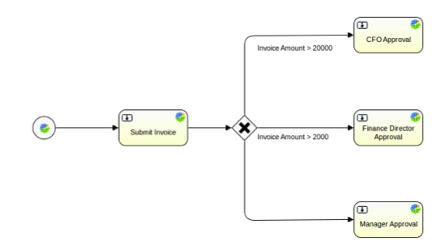

# Exclusive gateways

An exclusive gateway, or XOR gateway is used to model a decision in a process definition.

When the execution of a workflow arrives at this gateway, all outgoing sequence flows are evaluated in the order in which they are defined. The sequence flow whose condition evaluates to true, is selected for propagating the token flow.

Note that the semantics of an outgoing sequence flow:

-   In general in BPMN 2.0, all sequence flows whose conditions evaluate to true are selected to continue in a parallel way. When using an exclusive gateway, only one sequence flow is selected.
-   When multiple sequence flows have conditions which evaluate to true, only the first one defined is selected to continue the process.
-   If no sequence flow can be selected, an exception will be thrown. To ensure a sequence flow will always be selected, have no condition on one of your flows. No condition will always evaluate to true.

The following diagram shows an exclusive gateway that will choose one sequence flow based on the value of a property, in this example, the invoice amount. Only two flows have conditions on them going to CFO Approval and Finance Director Approval. The last sequence flow has no condition, and will be selected by default if the other conditional flows evaluate to false.

**Parent topic:**[Gateways](../concepts/wf-process-def-gateways.md)

