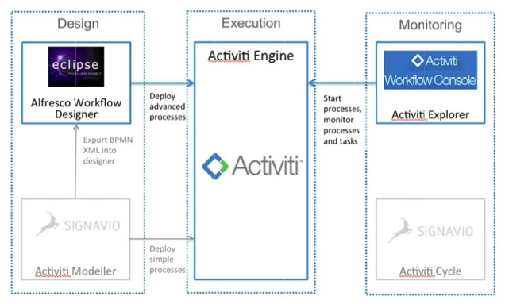

# Workflow tools

There are a number of tools you will need to design, execute, and monitor your workflows. Some of these are included with Alfresco, and some you may wish to obtain separately.

The following diagram shows the tools used in designing, executing, and monitoring an Alfresco workflow: 

-   **Activiti modeler**

    allows business and information analysts to model a BPMN 2.0 compliant business process in a web browser. This allows business processes to be shared, and no client software is needed before you can start modeling.

-   **Activiti designer**

    is an Eclipse plugin, which enables a developer to enhance the model of the business process into a BPMN 2.0 process that can be executed on the Activiti process engine. You can also run unit tests, add Java logic, and create deployment artifacts with the Activiti Designer.

-   **[The Activiti workflow console](../concepts/wf-activiti-workflow-console.md)**  
 The Activiti Workflow Console is a web based user interface that allows administration of workflow artifacts.

**Parent topic:**[Creating and managing workflows](../topics/wf-howto.md)

**Related information**  

[Activiti modeler](http://bpmn20inaction.blogspot.ca/2012/09/activiti-modeler-getting-started-part-1.html)

[Activiti designer](http://www.activiti.org/userguide/index.html#activitiDesigner)

