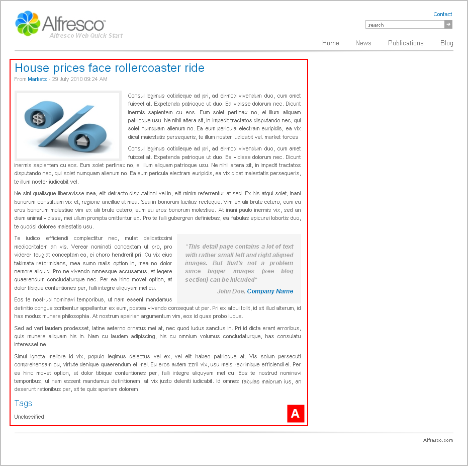

# articlepage1

The section **Alfresco Quick Start \> Quick Start Editorial \> root** has the template mapping `ws:article=articlepage1`.

This is a news style article template with an image.

View any news article on the Web Quick Start website to see a rendering of the `articlepage1` template. This template page has a two column layout.

|A|Component: `/article/style1`This component displays a news style article with a medium image.

|

**Parent topic:**[Templates](../references/qs-ref-templates.md)

