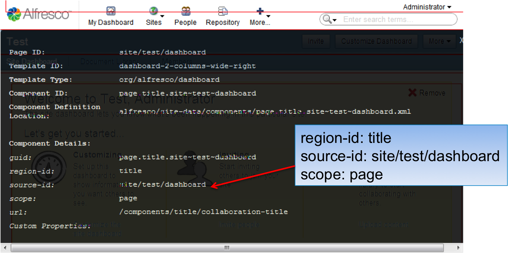
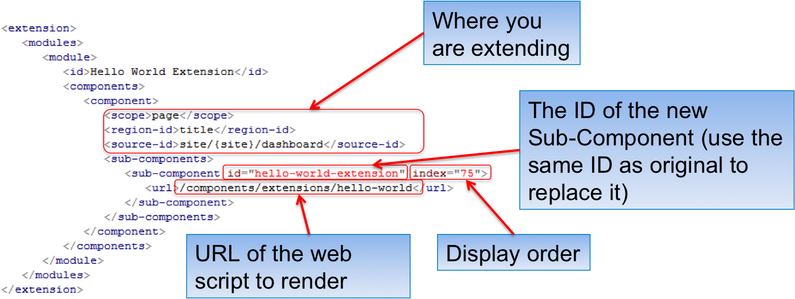
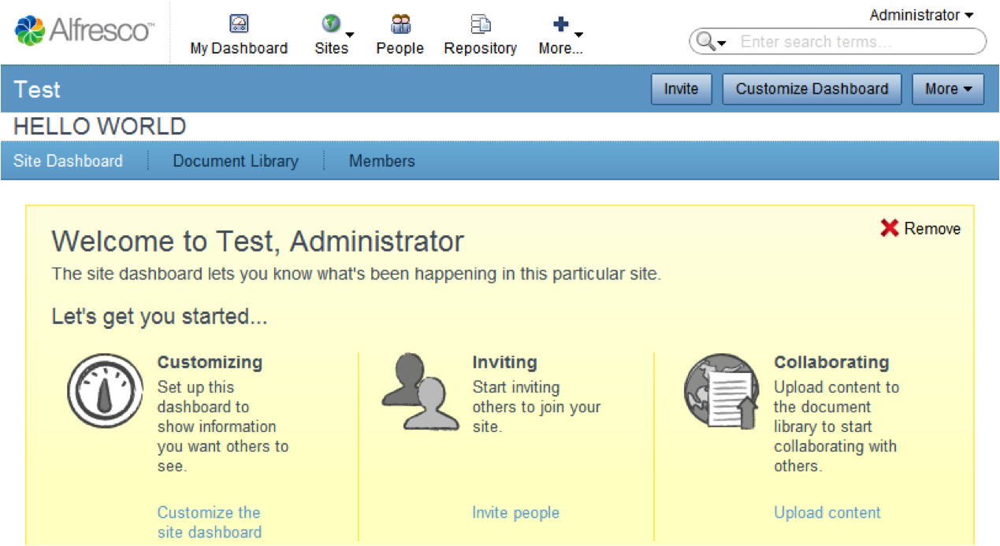

# Example - creating an Extension module

To familiarize yourself with the approach to creating an extension module, walk through a simple Hello World example.

1.  Find the component you want to extend using [Surfbug](../concepts/Surf_v4_surfbug.md#).

    

2.  Create your extension model definition.

    <TOMCAT\>/shared/classes/alfresco/web-extension/site-data/extensions/hello-world-extension.xml

    

    1.  Create the web script description document **hello-world.get.desc.xml** as follows:

        ```
        <webscript>
          <shortname>Hello World</shortname>
          <description>Hello World</description
          <url>/components/extensions/hello-world</url>
        </webscript> 
        ```

    2.  Create the web script response template "hello-world.get.html.ftl"

        ```
        <h1>HELLO WORLD</h1>
        ```

3.  Deploy the extension model for the following result.

    


**Parent topic:**[Creating an Extension module](../tasks/Create-a-Model.md)

