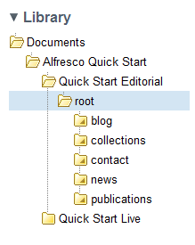

# Configuring Web Quick Start

After you have imported the Web Quick Start website data, when you have refreshed Share, or the next time you log on, you can access the Web Quick Start site for configuration.

1.  Open the Web Quick Start site.

2.  Navigate to the Document Library.

    The default site structure will have the following structure:

    

    The site structure contains two folders: Quick Start Editorial and Quick Start Live. These folders represent a separation between the work in progress content, and the finished, reviewed, editorially complete content that is then published to the “Live” environment.

If your web container is running on port 8080 and the web application is running in the same container as Alfresco, the setup is complete and you should be able to access the web site on [http://localhost:8080/wcmqs](http://localhost:8080/wcmqs).

-   **[Configuring the web application host name, port, and context](../tasks/WQS-config-single-app.md)**  
This section describes how to change the host name, port, and context for the Web Quick Start web application.
-   **[Disabling AWE on the Live environment](../tasks/WQS-config-AWE-disable.md)**  
The Web Editor \(AWE\) is configured to be enabled on the Editorial content, and disabled on the Live. This is controlled by the `isEditorial` flag on the **Quick Start Editorial** metadata. This also \(when complete\) dictates what can be viewed via the live web application with regards to publishing go live and expiry dates.

**Parent topic:**[Web Quick Start](../concepts/WQS-intro.md)

