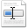

# Editing web content

Alfresco Web Editor in-context editing enables you to make changes to the editable content displayed on the current web page.

1.  Expand the **Quick Edit** menu \(\) on the Alfresco Web Editor toolbar to display a list of the editable content for the current web page.

    **Fastpath:** In addition to selecting from the menu, you can simply click the content marker associated with the content you wish to edit. This automatically opens the editing page.

2.  Position your cursor on the entry of interest.

    This highlights the related content on the page, allowing you to confirm it is the content you want to edit.

3.  Click the desired entry in the list.

    The first time you perform an edit, you are prompted for your Alfresco login details. Enter your username and password, then click **Login** to continue. This enables the **Logout** feature on the application toolbar.

    The editing page opens displaying the selected content and any configured metadata.

4.  Edit the metadata and content as necessary.

5.  Click **Submit**.

    The web page refreshes displaying the updated content.

**Parent topic:**[Alfresco Web Editor](../concepts/awe-introduction.md)

