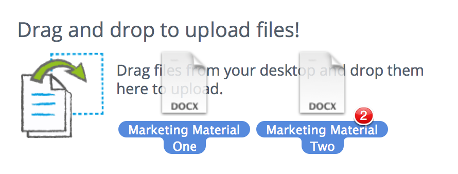

# Adding content items

First you'll look at adding content items such as documents, spreadsheets, presentations, and images to a site.

You're going to add two documents that you created previously to your site.

**Note:** The tutorial will use two documents named "Marketing Material One" and "Marketing Material Two". To help you follow this example you can also create two documents named the same, or if you prefer you can just use existing documents that you have.

1.  Click **Document Library** to display the document library.

    You can see that Alfresco gives you lots of options for getting content into the library. You can upload files, create folders, drag and drop files and even create content directly from Alfresco.

2.  You're going to drag and drop the content in - go to the location where you saved your two files, select them, and drag and drop them directly to the drag and drop area on the Document Library.

    

3.  Click **OK** when the upload is done and it's as simple as that. Your documents are now uploaded to the site library.

This video shows the steps in the tutorial.

  

**Parent topic:**[Working with content](../concepts/gs-site-prepare.md)

