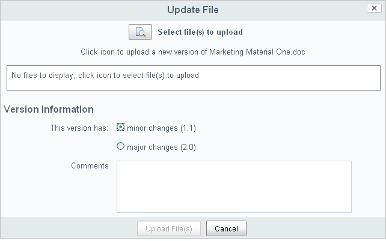

# Updating content

Updating your content in Alfresco is really easy to do and you can even select whether to edit online or offline.

1.  In the Document Library item list, hover your cursor over "Marketing Material One".

    This highlights the item and displays the actions available for that item.

2.  Click **More** and then select **Edit Offline**.

    Alfresco now shows a notification that the document is locked.

3.  Select the **Save File** option and click **OK** to save the document in a location from which you can edit it.

    The document is saved to this location with **\(Working Copy\)** added to the title.

4.  Now open the document from this location using you're preferred software and add in the following sentence: *This document is now ready for release*.

5.  When you've done that save and close it.

6.  Back in Alfresco, hover your curser over "Marketing Material One" and click More **Upload New Version**.

    

7.  In the Update File page click the browse icon and find and select "Marketing Material One \(Working Copy\)".

    Once selected, it displays in the Update File page.

8.  Leave the version on minor changes and click **Upload File\(s\)**.

9.  When the upload is finished click **OK**, and a modification update is shown on-screen.

10. Click **Site Dashboard** and you'll see update notifications in the dashlets.

This video shows the steps in the tutorial.

  

**Parent topic:**[Working with content](../concepts/gs-site-prepare.md)

