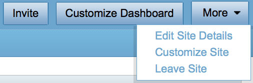

# Adding pages to a site

In Alfresco you can add functionality to your site such as a discussion forum, a wiki or a blog. These are known as page components.

At the top of your site dashboard are tabs for page components, or areas, of your site. By default you have Site Dashboard, Document Library, and Members. You can add additional page components as needed for a site. If you look at the Wiki dashlet that you added previously, you'll see that it says that no page is configured. You're now going to configure a wiki for the site.

1.  Click **More** and then **Customize Site**.

    

2.  Drag the Wiki and Calendar icons down into the Current Site Page area, and click **OK**.

    **Note:** Take a look at the Alfresco documentation [\(Using Alfresco\)](../topics/sh-uh-welcome.md) for more details on these page components.

Back on the site dashboard you can see that the wiki and calendar have been added to the page components at the top of the site dashboard. You now have a site set up! It's time to start adding some content...

This video shows the steps in the tutorial.

  

**Parent topic:**[Building a site](../concepts/gs-building-site.md)

