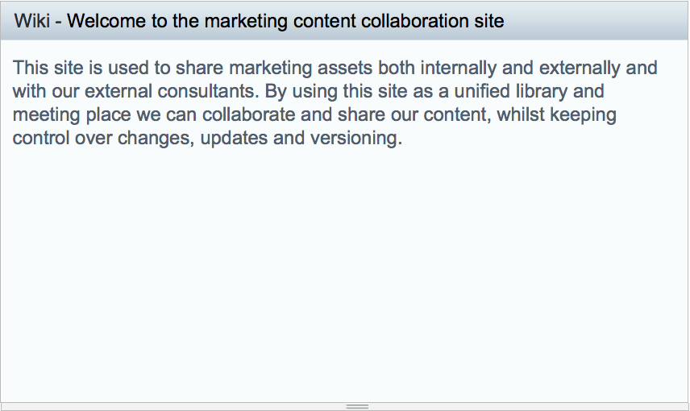

# Making content visible

Having set up your wiki, the next step is to show this content to users on the site dashboard.

1.  Hover your curser over the Wiki dashlet and click the Configure icon.

2.  When the Select Wiki Page displays click **OK** to select the page you just created.

    **Note:** When you've added more pages to the wiki you can select any of them from this menu.

    The Wiki dashlet displays the text from the selected wiki page.

    

This video shows the steps in the tutorial.

  

**Parent topic:**[Working with content](../concepts/gs-site-prepare.md)

