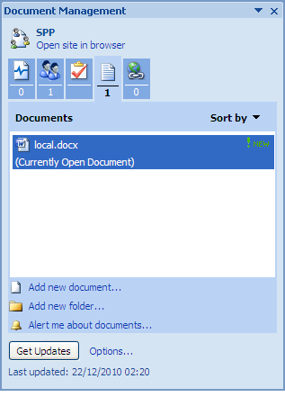
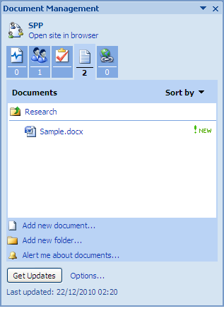

# Add content to the Document Workspace

Let’s presume you require research material for this site. In this step, you create a separate folder in the document library to contain this material and then add a document to the folder.

To create a folder and upload content:

1.  Open the Document Management task pane of the document local.docx and select the Documents tab.

    This tab displays the files and folders that currently reside in the site’s document library. From this tab, you can manage the contents of the Document Workspace.

    

2.  At the bottom of the task pane, click **Add new folder**.

3.  Enter Research as the **Folder Name** and click **OK**.

    The newly created folder appears in the **Documents** list on the task pane. You can now upload a document to it.

4.  Select the Research folder.

5.  Click **Add new document**.

6.  Click **Browse** on the **Add New Document** dialog box.

7.  Locate a Word document on your computer to upload and click **Open**.

    **Note:** The option **Make workspace updates available when I open my copy** enables you to create a link between this document on your computer and the copy being placed in the Share site. For this tutorial, do not check this option.

8.  Click **OK**.

    The document appears in the **Documents** list within the **Research** folder. The label **New** indicates the document has been recently uploaded.

    

    **Tip:** To remove a document from the Document Workspace, position your cursor over the document name, open the menu that becomes active, select **Delete**, and confirm the deletion when prompted.

9.  In Word, close the document local.docx.

**Parent topic:**[Manage a document](../concepts/gs-spp-doc-manage.md)

