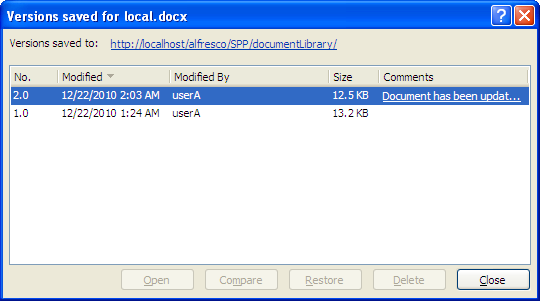
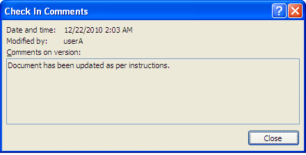

# Work with document versions

Once you add a document to the Document Workspace, it has version history. You can view and manage the versions from Word.

**Important:** Though enabled, Alfresco does not support deleting individual document versions.

Ensure local.docx is open. In this task, you will use this document to view the version history and then explore the other document version features available.

To view the version history:

1.  Click the Microsoft Office button and select **Server**, then **View Version History**.

    The Versions saved for local.docx dialog box displays all previous versions of the document. The information provided includes the version number, the date and time of the modification, the user who made the modification, and, where provided, a truncated comment.

    

2.  To view the full comment for a version listed, click the desired comment.

    The Check In Comments dialog box displays the full comment for the selected version.

    

3.  Close the Check In Comments dialog box.

-   **[View a previous version of the document](../tasks/gs-spp-versions-view.md)**  
Any version listed in the Versions saved for local.docx dialog box is available to be viewed. In this task you can view the original version of the document.
-   **[Manage the document versions](../tasks/gs-spp-versions-manage.md)**  
Selecting a previous version of the document in the Versions saved for local.docx dialog box enables both the **Restore** and **Delete** buttons.

**Parent topic:**[Manage a document](../concepts/gs-spp-doc-manage.md)

