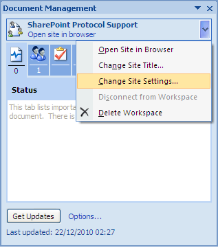
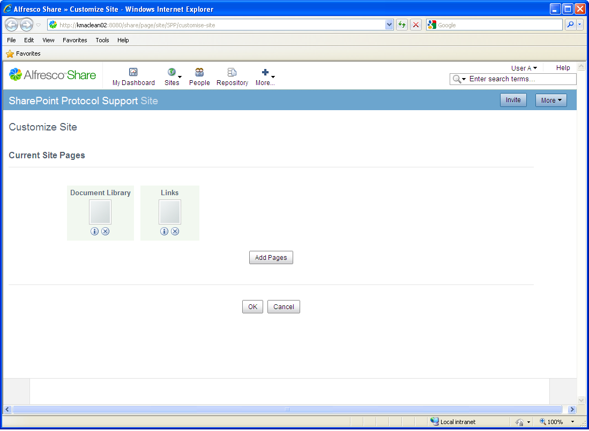

# Change the site settings

In Share, there are seven page components available for a site: Wiki, Blog, Document Library, Calendar, Links, Discussions, and Data Lists. By default, when you create a Document Workspace from Word, the site includes only the Document Library and Links components. From Word, you can easily access the Share page for customizing the site. Again, you will work from the document spp-tutorial.docx.

To customize the site:

1.  On the Document Management task pane of the document spp-tutorial.docx, position your cursor over the site name: **SharePoint Protocol Support**.

2.  Open the menu that becomes active and select **Change Site Settings**.

    

3.  Log in to Share as User A \(userA, userA\).

    The browser opens displaying the **Customize Site** page for the SharePoint Protocol Support site. Only the Document Library and Links page components are included in the site.

    

4.  Add and remove pages from the site as desired.

    For details on performing this task, refer to the Share user help.

    **Note:** Only the Document Library page component is required for this tutorial.

5.  Log out of Share and close the browser.

**Parent topic:**[Customize the Document Workspace](../concepts/gs-spp-workspace-customize.md)

