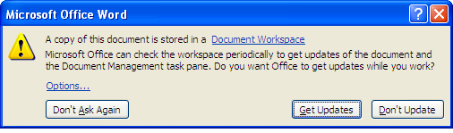

# Download document updates from the site

Use the file local.docx, which you used to create the SharePoint Protocol Support Document Workspace. It should still reside on your desktop; a copy also exists in the workspace \(Share site library\).

1.  Double-click local.docx on your desktop.

    The following prompt appears:

    

    As a copy of local.docx exists in the Document Workspace, it is possible that your local copy is no longer current. You want to synchronize your local copy with the site copy to ensure you have the current version.

2.  Click **Get Updates**.

    **Note:** If prompted, log in as User A \(userA, userA\)

    Word checks for and applies changes made by other members to the local copy of the document.

**Parent topic:**[Work with a Document Workspace document locally](../concepts/gs-spp-work-locally.md)

