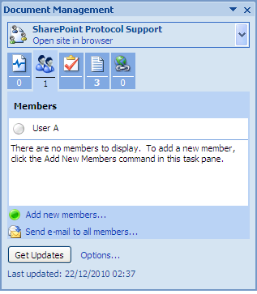

# Add users to the site

Currently only User A, whose login credentials you used to create the Document Workspace, is a member of the SharePoint Protocol Support site. The user who creates the site is automatically given the role of Site Manager.

To add users to the site:

1.  On the Document Management task pane of the document spp-tutorial.docx, select the **Members** tab.

    User A appears at the top of the tab.

    

2.  At the bottom of this pane, click **Add new members**.

3.  Type userB; userC to add User B and User C as members of the site.

4.  Select **SiteCollaborator** as the site role for these users and click **Next**.

    When adding multiple users, the users will all be assigned the same role. Once added, you can change the role for an individual site member.

5.  Confirm the member details displayed and click **Finish**.

    **Note:** You are prompted with the option to send an email notifying these users of their invitation to the site. Decline the notification and click **OK**.

    The **Members** tab displays the newly added site members: User B and User C.

**Parent topic:**[Manage the Document Workspace membership](../concepts/gs-spp-members-manage.md)

