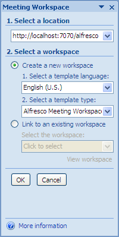
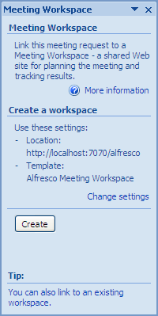
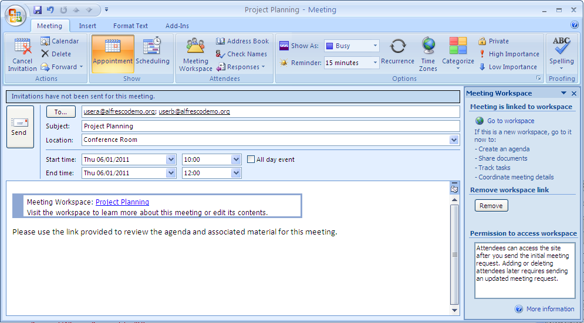

# Create a Meeting Workspace

You can create a Meeting Workspace in Share at the time you create a meeting request. The existing Share users that you add as meeting attendees automatically become members of the Meeting Workspace. The user who creates the Meeting Workspace automatically becomes the site manager.

To create a Meeting Workspace from Outlook:

1.  Open Outlook and create a meeting request in the Calendar view with the following details:

    -   **To**

        usera@alfrescodemo.org; userb@alfrescodemo.org

    -   **Subject**

        Project Planning

    -   **Location**

        Conference Room

    -   **Start time**

        any date in the future, 10:00

    -   **End time**

        same day as start date, 12:00

    -   **Message**

        Please use the link provided to review the agenda and associated material for this meeting.

2.  Click **Meeting Workspace** on the Meeting tab.

    The Meeting Workspace task pane opens on the right side of the dialog box.

    **Note:** If you are using Microsoft Office 2010 then this option is not available by default. You need to add the **Meeting Workspace** option to the Meeting tab as detailed [here](http://office.microsoft.com/en-gb/outlook-help/use-meeting-workspaces-to-organize-meetings-HA010356481.aspx).

3.  Click **Change settings** and configure the workspace as follows:

    1.  Specify **http://localhost:7070/alfresco** as the workspace location.

    2.  Select **Create a new workspace**.

    3.  Select **Alfresco Meeting Workspace** as the template type.

        If prompted, log in as the administrator \(admin, admin\).

        

        where localhost:7070 is the name of your Alfresco server and port number.

    4.  Click **OK**.

    The Meeting Workspace task pane displays the settings defined.

    

    **Tip:** You can either create a new Meeting Workspace from the meeting request or link the meeting to an existing workspace. For the purpose of this tutorial, you are creating a new workspace.

4.  Click **Create**.

    If prompted, log in as the administrator \(admin, admin\).

    Outlook creates the Meeting Workspace \(Share site\), adds to this the meeting being scheduled, and inserts a link into the body of the meeting request. This link provides attendees with easy access to the workspace.

    

5.  Click **Go to workspace** at the top of the task pane to access the Meeting Workspace. Again, log in as the administrator.

    Use this link to create an agenda and upload meeting materials to the site before sending the meeting request. These tasks are not required as part of the tutorial.

    The new Meeting Workspace opens with the calendar component displayed. The meeting request **Subject** line becomes both the meeting title and the workspace name \(non-alphanumeric characters, including spaces, are converted to underscores for the workspace name\). When you create a Meeting Workspace from Outlook, the site includes only the Document Library and Calendar components. To include additional page components—Wiki, Blog, Links, Discussions, or Data Lists—refer to the Share user help.

6.  Log out of Share and close the browser.

7.  In the meeting request in Outlook, click **Send**.

    Outlook sends the meeting request. In Share, the meeting attendees are added to the Meeting Workspace as site members. By default, they are given the role Collaborator.

**Parent topic:**[Collaborate with colleagues around a meeting](../concepts/gs-spp-mtgworkspace-intro.md)

