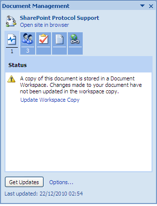

# Update the Document Workspace copy

When a local copy of a document is linked to a Document Workspace, Word detects changes made to the document and prompts you to resolve the discrepancy. While in the previous task you updated the local copy with the version from the workspace, in this task you will update the workspace copy with the local version.

1.  If not already displayed, open the Document Management task pane.

2.  Make some changes to your open document \(local.docx\) and save the document.

    The Status tab displays a warning indicating there is a discrepancy between the local copy and the workspace copy of the document.

    

3.  Click **Update Workspace Copy** on the **Status** tab.

    Word checks for and applies changes made in the local copy to the version in the Document Workspace.

**Parent topic:**[Work with a Document Workspace document locally](../concepts/gs-spp-work-locally.md)

