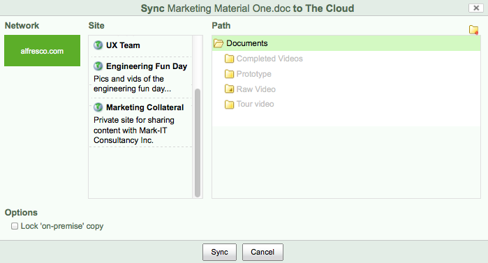

# Sharing your content on the cloud

You can now sync your content to the cloud, so that your external consultants can make updates to it.

**To share your content on the cloud:**

1.  Click **Document Library** then hover your cursor over the Marketing Material One document.

2.  Click **More** and then **Sync to Cloud**.

    The **Sync to The Cloud** page displays.

    

3.  Select the cloud network, site and path that you want to sync content to.

4.  Click the **Lock ‘on-premise’ copy** option, as you don’t want any of your team to update this while the external consultants are working on it.

5.  Click **Sync**, and a message will display informing you that the sync was created.

    Now the marketing consultants can access your content from the cloud site that you synced with, and edit it as required. Any changes they make will be replicated in the instance of the document you access from your on-premise site.

    **Note:** Content changes and important properties such as the item name and title are synced back to the on-premise version. Comments made in Alfresco, version changes, and more minor properties are not synced back to the on-premise version.

    **Tip:** If you want to add some edits of your own then position your cursor over the item and click **More** and then **View in Cloud**.

This video shows the steps in the tutorial.

  

**Parent topic:**[Sharing content externally](../concepts/gs-sync-share.md)

