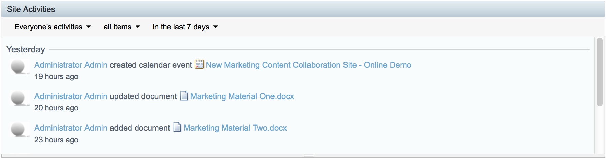

# Scheduling events

Having previously added a calendar to your site, you can now use it to schedule events for your team.

As part of the promotion for this collaboration site, I'm going to schedule a meeting to welcome new users and discuss the purpose of the site.

1.  Click **Calendar** to open the calendar.

2.  Click the **Add Event** icon \(\) on tomorrow's date and the Add Event page is displayed.

3.  Add *New Marketing Content Collaboration Site - Online Demo* as the What; because you're holding the meeting online you don't need to enter a Where, but you can enter a description if you like.

4.  Tomorrow's date will be pre-selected, with the time set at 12:00 till 13:00. That sounds good to me so leave it and click **OK**.

    You can see that the event has been created and scheduled in the calendar. And if you want to increase visibility of the events you schedule you can always add a calendar dashlet to the dashboard.

5.  Click **Site Dashboard** and refresh your browser and you'll see the meeting in the Site Activities dashlet.

    

This video shows the steps in the tutorial.

  

**Parent topic:**[Being social](../concepts/gs-being-social.md)

