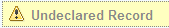

# Declaring a record

A content item isn't automatically considered to be a record. An uploaded item is considered to be part of the Records Management system only after it has been declared as a record.

1.  Navigate to an undeclared record in the File Plan.

    Undeclared records are easily identified by the Undeclared Record label.

    

2.  Click **Declare as Record** in the actions list.

    Records have mandatory metadata that you must complete. A message lets you know if required metadata is missing.

After the record is declared, it is under the control of the record category and security restrictions apply.

**Note:** A record can be filed in multiple categories.

**Parent topic:**[File Plan structure](../concepts/rm-fileplanstruct-create.md)

