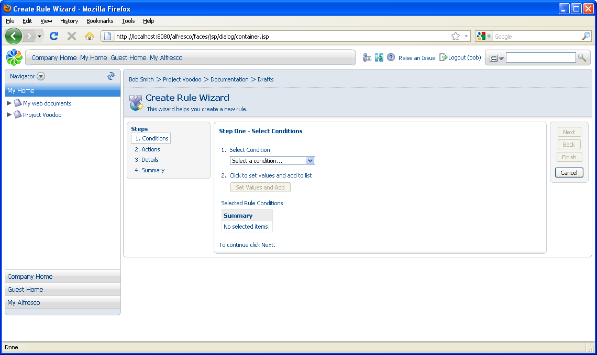
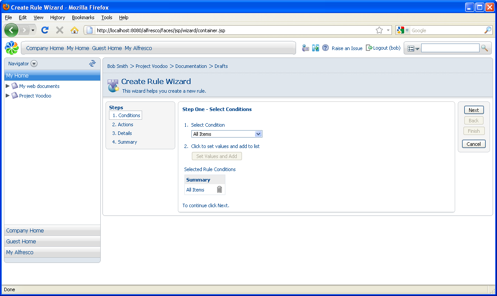
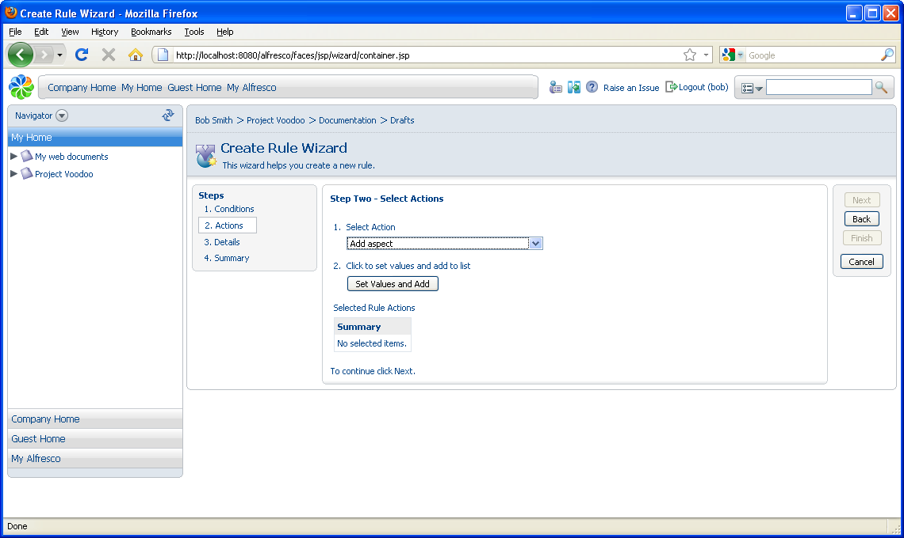
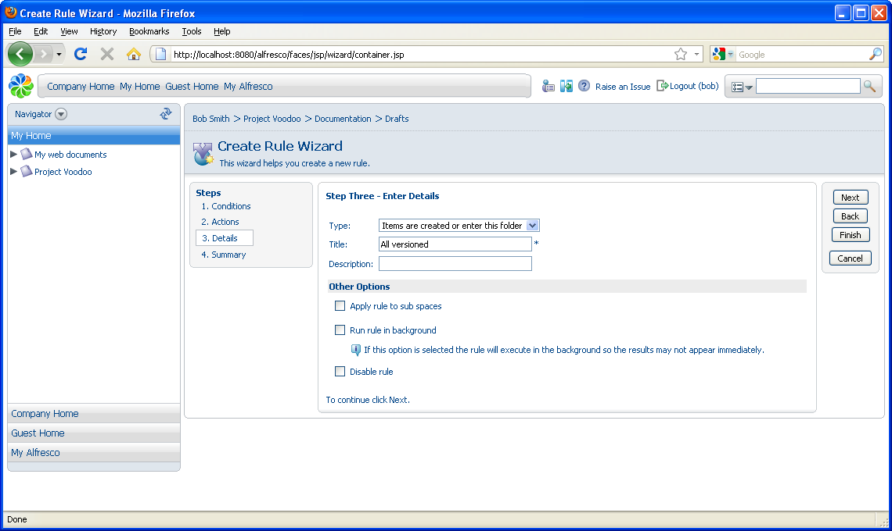
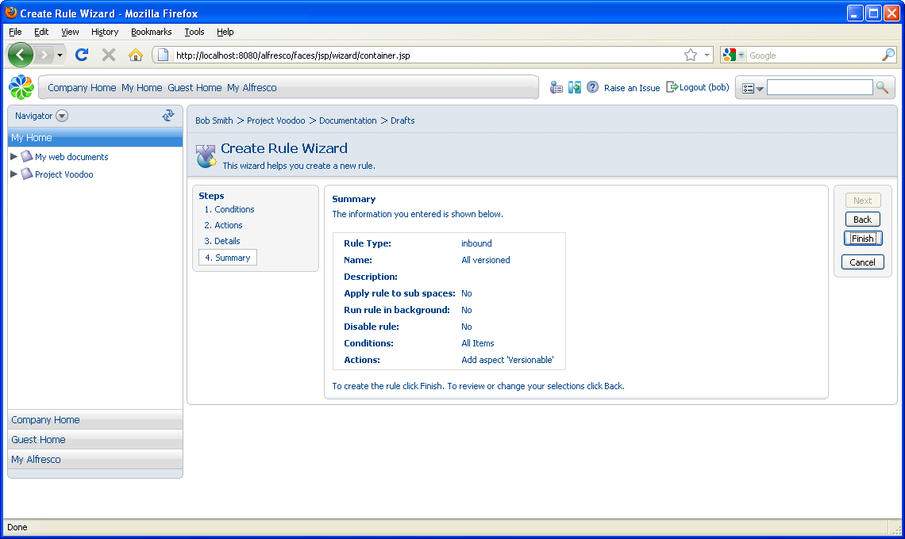
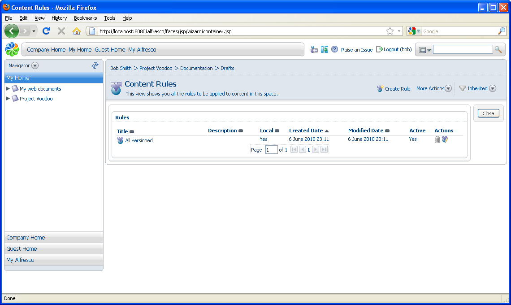

# Adding a content versioning rule

In this task, you will add a versioning rule for the content using the Create Rule Wizard.

1.  In the header, click **Create Rule** to open the Create Rule Wizard.

    

2.  In Step One - Select Conditions, define the conditions that are applied to the content before the action is performed.

    1.  In the **Select Condition** list, select **All Items**so the action is performed on any content added to the space.

    2.  Click **Add to List** to set the condition. The condition displays in the **Summary** list.

        

    3.  Click **Next**.

3.  In Step Two - Select Actions, you define the actions to be performed on the content.

    1.  In the **Select Action** list, click **Add aspect**.

        

    2.  Click **Set Values and Add.**

    3.  In the**Select required feature** menu, select**Versionable** from the value list and click**OK**.

    4.  Click **Next**.

4.  In Step Three - Enter Details, select the rule type, which determines when the rule gets tested. The options are:

    -   **Items are updated**: The action occurs when content is updated in the space.

    -   **Items are deleted or leave this folder**: The action occurs when content is moved or deleted from the space.

    -   **Items are created or enter this folder**: The action occurs when content is copied, created or added to the space.

    1.  In the **Type** menu, select **Items are created or enter this folder**.

    2.  In the **Title** box, type All versioned.

        

    3.  Click **Next**.

        

5.  Verify the information you have specified for the rule and click **Finish**.

    

    The rule displays on the Content Rules page.

**Parent topic:**[Building smart spaces](../concepts/cgs-smartspace.md)

