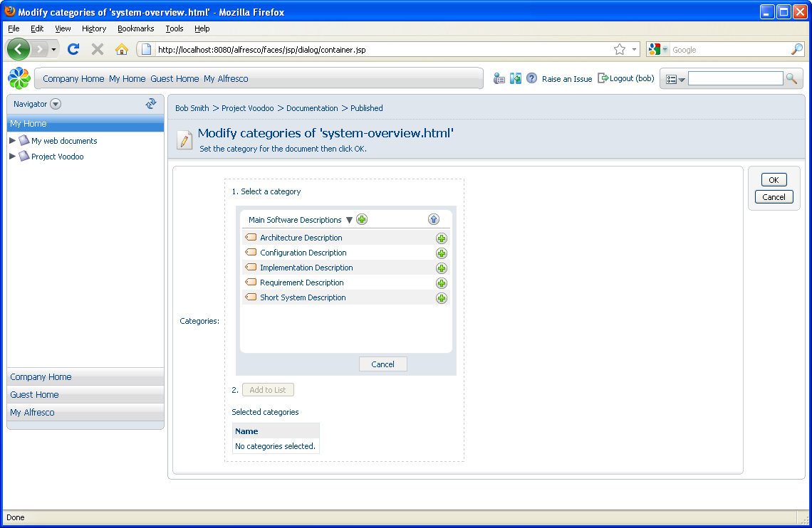

# Categorizing content and advanced search

Another feature is the ability to assign categories to items. This allows information to be classified in any number of ways. With this, you can retrieve items that match combinations of constraints, including categories. Categories are hierarchical, so searching for an item in a category will also find anything classified below it. In the following example, you are going to add some content to a category and then search for it.

The first step is to allow the content to be categorized.

1.  Navigate to the Published space and click  **\(View Details\)** for the document **system-overview.html**.

2.  Expand the Category pane and click **Allow Categorization**.

3.  Click  **\(Change Category\)** in the top right corner of this pane.

4.  Click **Select** and then **Click here to select a Category**.

5.  Click **Software Document Classification** to view its sub-categories.

6.  Click through the following sub-categories:

    -   Software Descriptions

    -   Main Software Descriptions

    

7.  Select **Short System Description** and click **Add to List**.

8.  Click **OK**.

-   **[Searching for categorized content](../tasks/tgs-search-content.md)**  
In this task you will use Advanced Search features to search for categorized content.

**Parent topic:**[Getting Started with Alfresco Explorer Document Management](../concepts/cgs-intro.md)

